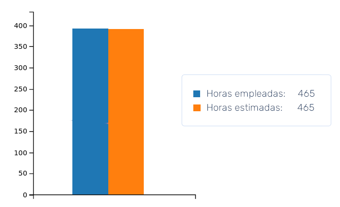
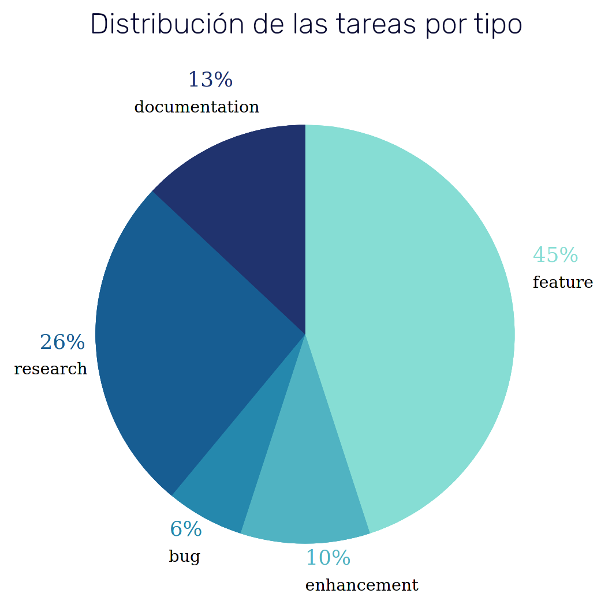
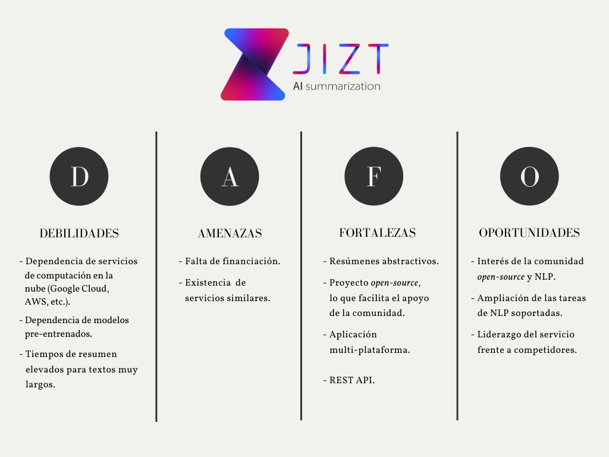

..
    Copyright (C) 2020-2021 Diego Miguel Lozano <jizt@diegomiguel.me>
    Permission is granted to copy, distribute and/or modify this document
    under the terms of the GNU Free Documentation License, Version 1.3
    or any later version published by the Free Software Foundation;
    with no Invariant Sections, no Front-Cover Texts, and no Back-Cover Texts.
    A copy of the license is included in the section entitled "GNU
    Free Documentation License".

.. _apendix:plan-proyecto:

=========================
Plan de Proyecto Software
=========================

Introducción
============

La planificación de todo proyecto es un proceso de gestión organizado e
integrado, centrado en las actividades necesarias para asegurar una
exitosa consecución del proyecto. Esta planificación contribuye a una
mejor utilización de los recursos, y a un uso óptimo del tiempo asignado
a un proyecto, algo crucial en todo proyecto, y especialmente relevante
en el caso de un Trabajo de Fin de Grado (TFG).

En este apartado se recogen los aspectos más relevantes en cuánto a la
planificación temporal de nuestro proyecto, así como su viabilidad,
tanto económica como legal.

Planificación temporal
======================

Una de las primeras decisiones que se llevaron a cabo en el marco del
proyecto JIZT, fue la elección de la metodología de desarrollo
*software* que adoptaríamos.

Lo primero que llevamos a cabo fue un análisis de las necesidades y
limitaciones que presentaba nuestro proyecto, las cuales eran: tiempo
limitado, eficiencia y velocidad, motivación y progreso del proyecto, y
satisfacción de los usuarios.

Derivado de estas necesidades, se decidió que emplearíamos una
metodología ágil. Las principales metodologías ágiles consideradas
fueron Scrum, Kaban y Programación Extrema (XP).

Finalmente, nos decantamos por Kanban. Esta decisión estuvo en gran
medida motivada por el hecho de que una planificación temporal rígida y
prefijada, como ocurre por ejemplo en Scrum, era muy difícil de llevar a
cabo en este proyecto dada nuestra inexperiencia con muchas de las
herramientas y *frameworks* utilizados.

Kanban nos permitía un flujo continuo de trabajo, permitiendo añadir
historias de usuario no contempladas inicialmente si así se consideraba
apropiado.

En total se estimaron 465 horas, de las cuales se emplearon realmente
464:

   Horas estimadas frente horas empleadas.

En esta planificación, se emplearon dos conceptos ágiles fundamentales:

-  **Historia de usuario**: se trata de una descripción de una
   funcionalidad del *software* a implementar.

-  **Epics**: agrupan historias de usuario que conformen una misma
   *feature*, o funcionalidad a desarrollar.

En total, se especificaron 99 historias de usuario repartidas entre 8
*epics*\ [1]_. Estos *epics* fueron, ordenados de manera cronológica:

-  **Puesta en marcha**: tareas preliminares de organización y puesta en
   marcha del proyecto (elección de metodologías, herramientas, etc.).

-  **Motor de Resumen v0.1**: implementar una primera versión del Motor
   de Resumen a través de los modelos preentrenados proporcionados por
   el módulo ``transformers`` de Hugging Face [transformers]_.

-  **Arquitectura Microservicios v0.1**: implementar una primera versión
   reducida de la Arquitectura de Microservicios, configurando el
   componente Ingress de Kubernetes [ingress]_, y dos
   microservicios: el Dispatcher y el Pre-procesador de textos.

-  **Arquitectura Microservicios v0.2**: continuar con la implementación
   de la arquitectura de microservicios, añadiendo la capacidad de
   realizar peticiones asíncronas y desarrollando la arquitectura
   dirigida por eventos. De momento, se sigue trabajando con una versión
   de la misma, esto es, con el Dispatcher y el Pre-procesador de
   textos.

-  **Arquitectura Microservicios v0.3**: una vez disponemos de una
   versión reducida de nuestra arquitectura que funciona correctamente
   en local, el siguiente paso es desplegarla en Google Kubernetes
   Engine (GKE) [gke]_. Además, se deben implementar los
   microservicios restantes (Codificador, Motor de Resumen y
   Post-procesador) y la base de datos para gestionar los resúmenes.

-  **Cliente v0.1**: desarrollar el cliente (aplicación) que consumirá
   la API y permitirá al usuario final obtener resúmenes de sus textos.
   Dicho cliente se implementará con ayuda de Flutter [flutter-es]_, por lo que en principio estará disponible en
   plataformas móvil, *web* y escritorio.

-  **Arquitectura Microservicios v0.4**: ampliar la especificación de la
   API para que en las peticiones se puedan detallar todos los
   parámetros del resumen. Continuar con la mejora del sistema.

-  **Documentación v0.1**: escribir la Memoria y los Anexos. Generar una
   primera versión de la documentación de la API REST y del código
   perteneciente a JIZT.

En la siguiente figura se recoge un diagrama Gantt con el objetivo de facilitar la
comprensión de la dimensión temporal del proyecto:

.. figure:: ../_static/images/memoria_y_anexos/gantt-epics.png
   :alt: El proyecto comenzó el 1 de octubre de 2021, y finalizó el 16 de febrero de 2021.
   :name: gantt

   El proyecto comenzó el 1 de octubre de 2021, y finalizó el 16 de
   febrero de 2021.

Dos conceptos importantes dentro de la metodología son *lead time* y
*cycle time* [anderson10]_. Veamos qué significa cada uno
de ellos.

-  *Lead time*: es el período que transcurre entre la aparición de una
   nueva tarea en el flujo de trabajo y su salida final del sistema.
   Dicho de otro modo, es el tiempo total que el cliente está esperando
   la entrega de una parte del producto.

-  *Cycle time*: es la cantidad de tiempo que el equipo realmente empleó
   en una tarea, es decir, no se cuenta el tiempo que una tarea estuvo
   «en espera». Por lo tanto, el tiempo del ciclo debe comenzar a
   medirse cuando la tarea pasa a la columna «trabajando», y no antes.

.. figure:: ../_static/images/memoria_y_anexos/lead-cycle-time.png
   :alt: Explicación gráfica del *lead* y *cycle time* sobre un tablero Kanboard.

   Explicación gráfica del *lead* y *cycle time* sobre un tablero
   Kanboard.

Esta métrica nos aporta información que nos permite conocer cuánto
tiempo tardaremos en entregar una determinada parte del producto. Es
importante mantener el *lead* y *cycle time* tan cortos como sea
posible, a fin de mantener pocas tareas «en ejecución» (WIP),
permitiendo mantener un flujo constante de trabajo y aportar valor al
cliente de manera frecuente.

.. figure:: ../_static/images/memoria_y_anexos/average-lead-cycle.png
   :alt: Gráfico de *lead* y *cycle time* medios.
   :name: average-lead-cycle

   Gráfico de *lead* y *cycle time* medios.

Como vemos en la anterior figura, el *lead time* medio fue de algo menos de 7 días, y
el *cycle time* de 4 días y 8 horas. Como es lógico, las primeras tareas
se completaron más rápido, pero según la complejidad de las mismas fue
incrementándose, también se reflejo en los tiempos. En el punto central
del proyecto, se alcanzó una media de *lead time* de 9 días, aunque el
*cycle time* se mantuvo por debajo de los 5, lo que indica que existía
un mayor número de tareas esperando a ser atendidas.

Otro de los gráficos propios de Kanban que nos puede ofrecer información
valiosa es el llamado diagrama de flujo acumulado (CFD, por sus siglas
en inglés). Este gráfico muestra el número de tareas que hay en cada
columna a lo largo del tiempo.

.. figure:: ../_static/images/memoria_y_anexos/cfd.png
   :alt: Diagrama de flujo acumulado desde el comienzo del proyecto.
   :name: cfd

   Diagrama de flujo acumulado desde el comienzo del proyecto.

Como se aprecia en el anterior diagrama, el trabajo en las diferentes columnas se
distribuyó de forma correcta, no apareciendo grandes diferencias entre
ellas. En este gráfico, también podemos apreciar que en la parte central
del proyecto, las tareas en «*Work in progress*» fueron algo mayores
que en el resto de columnas, lo cual es comprensible.

El diagrama de flujo acumulado obtenido muestra también que el ritmo de
trabajo fue constante, incrementándose ligeramente hacia el final del
proyecto.

Podemos visualizar también la distribución de las tareas en función de
su tipo:

   Distribución de las tareas según su tipo.

Como es lógico, la mayor parte de las tareas se dedicaron a ofrecer
nuevas funcionalidades (*feature*), aunque gran número de ellas se
dedicaron al aprendizaje y búsqueda de información (*research*), lo cual
también parece ajustarse a la realidad, puesto que como ya hemos
mencionado, muchas de las herramientas y técnicas que hemos utilizado
eran nuevas para nosotros.

Para finalizar esta sección, cabe mencionar que en el `repositorio del
proyecto <https://github.com/dmlls/jizt/milestones>`__, y en su `tablero
Kanban <https://board.jizt.it/public/board/c08ea3322e2876652a0581e79d6430e2dc0c27720d8a06d7853e84c3cd2b>`__,
se puede encontrar información más detallada de cada historia de usuario
y *epic*.

Estudio de viabilidad
=====================

Viabilidad económica
--------------------

Uno de los puntos cruciales a la hora de estudiar la viabilidad de un
proyecto, y que en muchos casos determina el éxito o el fracaso del
mismo, es la viabilidad económica.

En esta sección analizamos los costes y beneficios de JIZT.

Costes del proyecto
~~~~~~~~~~~~~~~~~~~

En nuestro caso, dividiremos los costes del proyecto en costes fijos,
directos e indirectos.

**Costes fijos**

Los costes fijos son aquellos costes invariables que debemos abonar,
independientemente del desarrollo del proyecto [perez18]_.

.. rst-class:: .table-fixed-costs
.. table:: Desglose de costes fijos del proyecto.

   +------------------------------------------+-----------------+
   | **CONCEPTO**                             | **IMPORTE**     |
   +==========================================+=================+
   | Servicio de Internet                     | 200,00 €        |
   +------------------------------------------+-----------------+
   | Servicio de Luz\ [2]_                    | 225,00 €        |
   +------------------------------------------+-----------------+
   | Materiales de oficina                    | 5,00 €          |
   +------------------------------------------+-----------------+
   | Salarios\ [3]_                           | 9911,88 €       |
   +------------------------------------------+-----------------+
   | » *Salario mensual neto*                 | 1000,00 €       |
   +------------------------------------------+-----------------+
   | » *Retenciones  por IRPF (24%)*\ [4]_    | 528,63 €        |
   +------------------------------------------+-----------------+
   | » *Cuotas a la Seg. Social (30,6%)*\ [5]_| 674,01 €        |
   +------------------------------------------+-----------------+
   | » *Salario mensual bruto*                | 2202,64 €       |
   +------------------------------------------+-----------------+
   | **TOTAL**                                | **10341,88 €**  |
   +------------------------------------------+-----------------+

-------

**Costes directos**

Los costes directos son aquellos costes derivados directamente del
desarrollo del proyecto.

.. rst-class:: .table-direct-costs
.. table:: Desglose de costes directos del proyecto.

   +------------------------------------------+---------------+---------------+
   | **CONCEPTO**                             | **IMPORTE**   | **AMORTIZ.**  |
   +==========================================+===============+===============+
   | Costes de *hardware*\ [6]_               | 2509,58 €     | 79,49 €       |
   +------------------------------------------+---------------+---------------+
   | » *Ordenador personal*                   | 845,00 €      | 63,37 €       |
   +------------------------------------------+---------------+---------------+
   | » *Smartphone Android*                   | 215,00 €      | 16,12 €       |
   +------------------------------------------+---------------+---------------+
   | » *Servicio GKE*\ [7]_ *de Google Cloud* | 1449,58 €     | \-            |
   +------------------------------------------+---------------+---------------+
   | Costes de *software*\ [8]_               | 89,95 €       | 16,86 €       |
   +------------------------------------------+---------------+---------------+
   | » *Adobe Illustrator*                    | 89,95 €       | 16,86 €       |
   +------------------------------------------+---------------+---------------+
   | **TOTAL**                                | **2599,53 €** | **96,35 €**   |
   +------------------------------------------+---------------+---------------+

-------

**Costes indirectos**

Los costes indirectos son aquellos que no dependen directamente del
desarrollo del proyecto.

.. rst-class:: .table-indirect-costs
.. table:: Desglose de costes indirectos del proyecto.

   +----------------------------------------------+-------------+
   | **CONCEPTO**                                 | **IMPORTE** |
   +==============================================+=============+
   | Dominio `jizt.it <https://www.jizt.it>`__    | 4,81 €      |
   +----------------------------------------------+-------------+
   | Cuenta de Google Play                        | 20,76 €     |
   +----------------------------------------------+-------------+
   | Impresión de la Memoria y el cartel del TFG  | 40,00 €     |
   +----------------------------------------------+-------------+
   | **TOTAL**                                    | **65,57 €** |
   +----------------------------------------------+-------------+

-------

**Costes totales del proyecto**

Considerando las tres categorías de costes recogidas anteriormente, la
suma de los costes totales del proyecto asciende a **13006,10 €**.

-------

Beneficios
~~~~~~~~~~

La API REST de JIZT se ofrece en tres planes de suscripción diferentes.

-  **Gratuito**: este plan se ajusta a las necesidades de cualquier
   usuario regular que no vaya a realizar un uso exhaustivo del
   servicio. Se permiten 5.000 peticiones a la API REST, pudiendo
   hacerse hasta 5 peticiones por minuto. No incluye soporte técnico.

-  **Estándar**: para aquellas empresas o particulares que van a
   realizar un uso más intensivo del servicio. Se incluyen 15.000
   peticiones a la API REST, pudiendo hacerse hasta 15 peticiones por
   minuto. Incluye soporte técnico y de integración. El precio es de 166
   €/mes.

-  **Personalizado**: para aquellos usuarios cuyas necesidades no
   encajen en ninguno de los anteriores precios. El precio se
   establecerá en función de los requerimientos concretos del usuario.

En cuanto a la aplicación, es totalmente gratuita y no contiene
publicidad.

Análisis DAFO
-------------

Tras llevar a cabo un pequeño análisis de mercado, hemos identificado
que las principales debilidades, amenazas, fortalezas y oportunidades de
nuestro proyecto son las siguientes:

   Análisis DAFO de JIZT.

Viabilidad legal
----------------

Licencia del código fuente del proyecto
~~~~~~~~~~~~~~~~~~~~~~~~~~~~~~~~~~~~~~~

Desde un primer momento nuestra intencción era licenciar el proyecto
bajo una licencia de *Software* Libre. Dentro de este entorno, se han
considerado las tres licencias más extendidas: Apache-2.0, MIT, y GPLv3.

Tras una lectura exhaustiva de las cláusulas de cada una de ellas, así
como de opiniones en *blogs*, charlas, foros, etc., y tras una profunda
reflexión, considerando especialmente la licencia MIT y la GPLv3, hemos
tomado la decisión de que nuestro software estará licenciado bajo **GNU
GPLv3** [gplv3]_, cuyos puntos principales se recogen a continuación:

.. figure:: ../_static/images/memoria_y_anexos/gnu-gpl3.png
   :alt: Resumen de la licencia GNU GPLv3. Imagen extraída y traducida de https://github.com/dmlls/jizt/blob/main/LICENSE.
   :name: gnu-gpl3
   :width: 90%
   :align: center

   Resumen de la licencia GNU GPLv3. Imagen extraída y traducida de
   https://github.com/dmlls/jizt/blob/main/LICENSE.

Se puede acceder a la licencia completa a través de
https://www.gnu.org/licenses/gpl-3.0.en.html.

Las principales razones de nuestra elección son:

-  Pese a que la licencia MIT pueda parecer más permisiva en un primer
   lugar, ya que no obliga a que el código fuente se mantenga abierto en
   un futuro, creemos que a largo plazo esta «permisividad»,
   paradójicamente, puede resultar en una limitación de sí misma. Esto
   es, el hecho de que ese supuesto *software* «libre» se pueda volver
   *software* «cerrado», lo excluye en primer lugar de esa definición
   de «libre», en nuestra opinión.

-  Este proyecto no podría existir sin las contribuciones de *software*
   libre anteriores. Por ello, queremos asegurar que este proyecto
   siempre se mantenga abierto para poder ayudar a otros y
   retroalimentarse con los aportes de la comunidad.

-  El simple hecho de elegir una licencia, conlleva un sinnúmero de
   implicaciones morales, económicas, sociales, etc., pero es algo
   necesario, ya que el *software* sin licencia explícita se toma por
   defecto como licenciado bajo *copyright*.

**Listado de dependencias**

Todas las dependencias del proyecto se encuentran licenciadas bajo
licencias compatibles con GNU GPLv3.

A continuación, se recoge una lista detallada de las mismas:

.. rst-class:: .table-dependencies
.. table:: Listado de dependencias.

   +------------------------+-------------+---------------------------------------------------+-------------+
   | **Dependencia**        | **Versión** | **Descripción**                                   | **Licencia**|
   +========================+=============+===================================================+=============+
   | **API REST**           |             |                                                   |             |
   +------------------------+-------------+---------------------------------------------------+-------------+
   | ``NLTK``               |     3.5     | Utilidades de NLP.                                | Apache v2.0 |
   +------------------------+-------------+---------------------------------------------------+-------------+
   | ``transformers``       |     4.1.1   | Modelos pre-entrenados.                           | Apache v2.0 |
   +------------------------+-------------+---------------------------------------------------+-------------+
   | ``truecase``           |     0.0.12  | *Truecaser*.                                      | Apache v2.0 |
   +------------------------+-------------+---------------------------------------------------+-------------+
   | ``confluent-kafka``    |     1.5.0   | Cliente de Kafka para Python                      | Apache v2.0 |
   +------------------------+-------------+---------------------------------------------------+-------------+
   | ``strimzi-operator``   |     0.21.0  | Kafka en Kubernetes                               | Apache v2.0 |
   +------------------------+-------------+---------------------------------------------------+-------------+
   | ``postgres-operator``  |     4.5.1   | PostgreSQL en Kubernetes                          | Apache v2.0 |
   +------------------------+-------------+---------------------------------------------------+-------------+
   | ``blingfire``          |     0.1.3   | Utilidades de NLP.                                | MIT         |
   +------------------------+-------------+---------------------------------------------------+-------------+
   | ``marshmallow``        |     4.5.1   | Serialización y desearialización.                 | Apache v2.0 |
   +------------------------+-------------+---------------------------------------------------+-------------+
   | **Aplicación**         |             |                                                   |             |
   +------------------------+-------------+---------------------------------------------------+-------------+
   | ``hive``               |     1.4.4+1 | Base de datos noSQL.                              | Apache v2.0 |
   +------------------------+-------------+---------------------------------------------------+-------------+
   | ``flutter_bloc``       |     6.1.2   | Patrón bloc en Flutter.                           | MIT         |
   +------------------------+-------------+---------------------------------------------------+-------------+
   | ``flutter_svg``        |    0.19.2+1 | Soporte para SVG.                                 | MIT         |
   +------------------------+-------------+---------------------------------------------------+-------------+
   | ``clipboard``          |     0.1.2+8 | Portapapeles.                                     | BSD         |
   +------------------------+-------------+---------------------------------------------------+-------------+
   | ``json_serizalizable`` |     3.5.1   | Serialización de JSON.                            | BSD         |
   +------------------------+-------------+---------------------------------------------------+-------------+
   | ``json_annotation``    |     3.1.1   | Anotaciones de JSON.                              | BSD         |
   +------------------------+-------------+---------------------------------------------------+-------------+
   | ``share``              |     0.6.5+4 | Soporte para compartir en diferentes plataformas. | BSD         |
   +------------------------+-------------+---------------------------------------------------+-------------+
   | ``http``               |     0.12.2  | Soporte para HTTP.                                | BSD         |
   +------------------------+-------------+---------------------------------------------------+-------------+

Licencia de la documentación del proyecto
~~~~~~~~~~~~~~~~~~~~~~~~~~~~~~~~~~~~~~~~~

La totalidad de la documentación de JIZT se distribuye bajo licencia GNU
Free Documentation License (GFDL) [gfdl]_.

Esta licencia es una adaptación al contexto de la documentación de la
GNU General Public License (GPL), la cual está pensada para licenciar
código fuente.

La GFDL da permiso a los lectores de copiar, redistribuir y modificar
una obra (excepto las «secciones invariables») y exige que todas las
copias y derivados estén disponibles bajo la misma licencia. Las copias
también pueden venderse comercialmente, pero, si se producen en grandes
cantidades (más de 100), el documento original o el código fuente deben
ponerse a disposición del destinatario de la obra [gfdl]_.

Se puede acceder a la licencia completa en
https://www.gnu.org/licenses/fdl-1.3.html.

Licencia de la Memoria y los Anexos del proyecto
~~~~~~~~~~~~~~~~~~~~~~~~~~~~~~~~~~~~~~~~~~~~~~~~

Los documentos referentes a la Memoria y a los Anexos (excepto los
apéndices y ), se encuentran licenciados bajo Creative Commons
Atribución-CompartirIgual 4.0 Internacional (CC BY-SA 4.0).

Esta licencia se puede resumir en los siguientes puntos
[creative-commons]_:

-  Cualquiera es libre de:

   -  Compartir: copiar y redistribuir el material en cualquier medio o
      formato.

   -  Adaptar: remezclar, transformar y construir a partir del material
      para cualquier propósito, incluso comercialmente.

-  Bajo los siguientes términos:

   -  Atribución: se debe dar crédito de manera adecuada, brindar un
      enlace a la licencia, e indicar si se han realizado cambios. Puede
      hacerse en cualquier forma razonable, pero no de forma tal que
      sugiera que aquel que lo usa, o su uso tienen el apoyo del
      licenciante.

   -  *CompartirIgual*: si remezcla, transforma o crea a partir del
      material, debe distribuir su contribución bajo la la misma
      licencia del original.

| Se puede acceder a la licencia completa a través de
| https://creativecommons.org/licenses/by-sa/4.0/legalcode.es.

.. [1]
   Para la representación de las historias de usuarios y los *epics* a
   GitHub se emplearon *Issues* y *Milestones*, respectivamente.

.. [2]
   Costes calculados para 4,5 meses, con tarifa de mercado libre y potencia
   contratada de 3,3 kW (precio mensual medio de 50 €).

.. [3]
   Costes calculados para 4,5 meses.

.. [4]
   Según la tabla de retenciones por IRPF aplicable al ejercicio 2021 [irpf21]_.

.. [5]
   Porcentaje para autónomos según la Ley 11/2020, de 30 de diciembre, de
   Presupuestos Generales del Estado para el año 2021 [boe341]_.

.. [6]
   Se han calculado con una amortización de 5 años, habiendo sido utilizado 4,5 meses.

.. [7]
   Google Kubernetes Engine [gke]_.

.. [8]
   Se han calculado con una amortización de 2 años, habiendo sido utilizado 4,5 meses.

.. [transformers]
   Hugging Face. Transformers. Sep. de 2020. URL:
   https://huggingface.co/transformers/index.html.
   Último acceso: 08/02/2021.

.. [ingress]
   Kubernetes. Ingress. Feb. de 2021. URL:
   https://kubernetes.io/docs/concepts/services-networking/ingress.
   Último acceso: 08/02/2021.

.. [gke]
   Google Cloud. Google Kubernetes Engine (GKE). Oct. de 2020. URL:
   https://cloud.google.com/kubernetes-engine.
   Último acceso: 08/02/2021.

.. [flutter-es]
   Flutter. Flutter - Hermosas apps nativas en tiempo record. Sep. de 2020. URL:
   https://esflutter.dev. Último acceso: 08/02/2021.

.. [anderson10]
   David J. Anderson. Kanban: Successful Evolutionary Change for Your
   Technology Business. Blue Hole Press, abr. de 2010. ISBN: 0984521402.

.. [perez18]
   Juan Antonio Pérez López. Fundamentos de la dirección de empresas.
   RIALP, abr. de 2018. ISBN: 9788432149184.

.. [irpf21]
   Agencia Tributaria. Cuadro informativo tipos de retención aplicables. 2021. URL:
   https://www.agenciatributaria.es/static_files/Sede/Programas_ayuda/Retenciones/2021/CUADRO_TIPOS_RETENC_IRPF21.doc.
   Último acceso: 08/02/2021.

.. [boe341]
   Agencia Estatal Boletín Oficial del Estado. Boletín Oficial del Estado,
   Núm. 341. Dic. de 2020. URL:
   https://www.boe.es/eli/es/l/2020/12/30/11/dof/spa/pdf.
   Último acceso: 08/02/2021.

.. [gplv3]
   The GNU Operating System y the Free Software Movement. GNU
   General Public License v3.0. Jun. de 2007. URL:
   https://www.gnu.org/licenses/gpl-3.0.en.html.
   Último acceso: 09/02/2021.

.. [gfdl]
  The GNU Operating System y the Free Software Movement. GNU
   Free Documentation License. Nov. de 2008. URL:
   https://www.gnu.org/licenses/fdl-1.3.html.
   Último acceso: 09/02/2021.

.. [creative-commons]
   Creative Commons. CC BY-SA 4.0. Feb. de 2019. URL:
   https://creativecommons.org/licenses/by-sa/4.0/deed.es.
   Último acceso: 12/02/2021.

