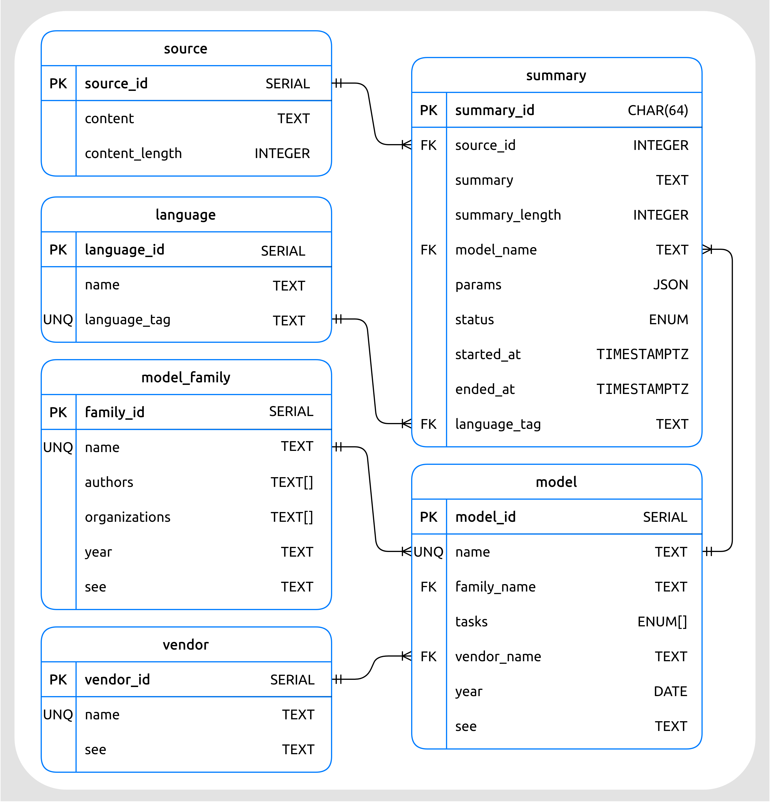
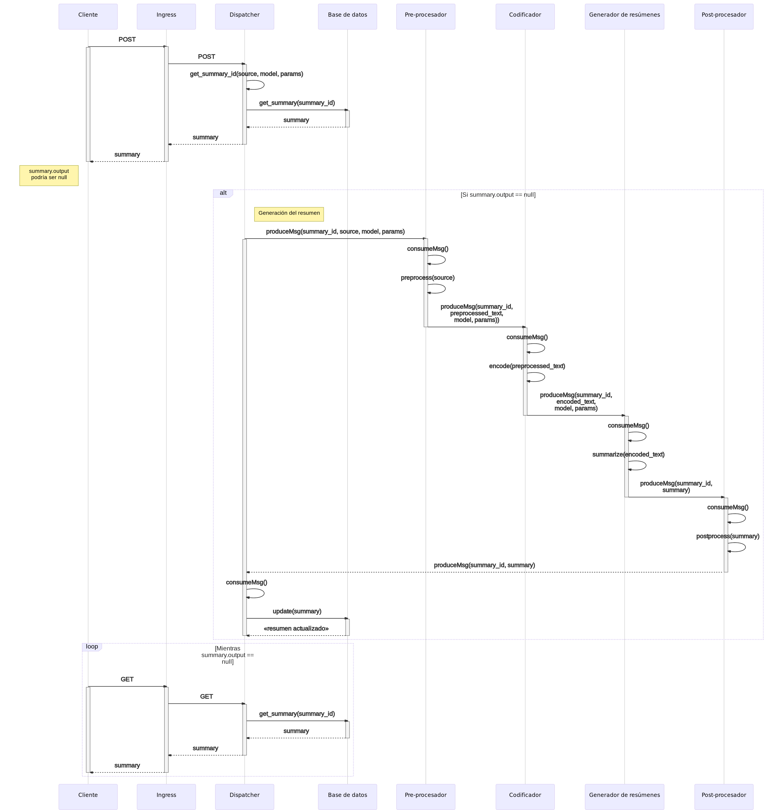
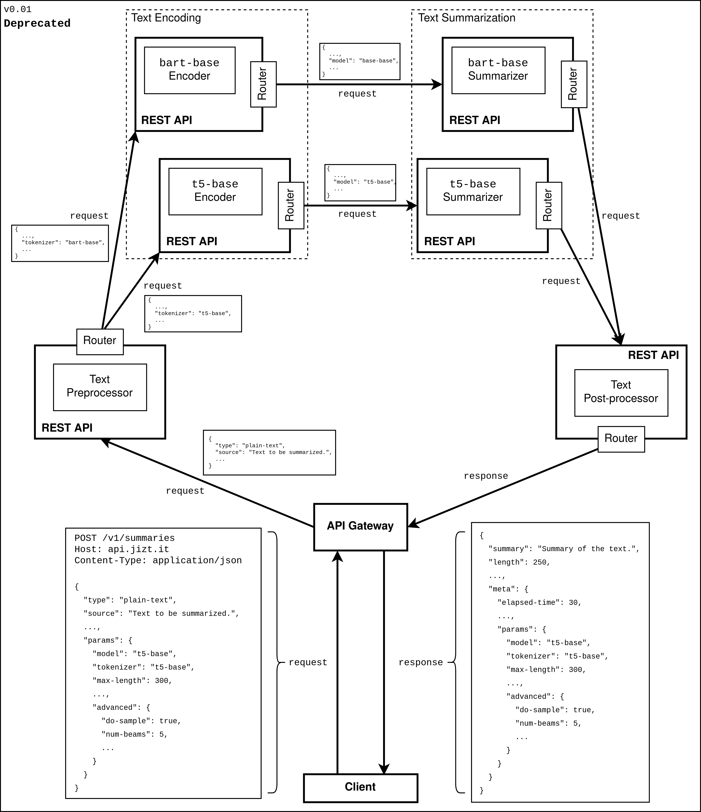
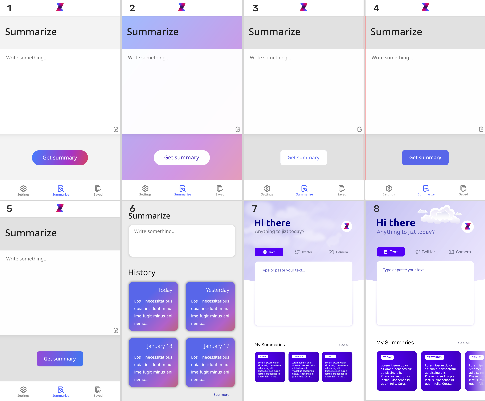

..
    Copyright (C) 2020-2021 Diego Miguel Lozano <jizt@diegomiguel.me>
    Permission is granted to copy, distribute and/or modify this document
    under the terms of the GNU Free Documentation License, Version 1.3
    or any later version published by the Free Software Foundation;
    with no Invariant Sections, no Front-Cover Texts, and no Back-Cover Texts.
    A copy of the license is included in the section entitled "GNU
    Free Documentation License".

.. _apendix:diseno:

========================
Especificación de diseño
========================

Introducción
============

En este apéndice se recogen las características de diseño que
implementan los requisitos descritos en el apéndice anterior, a fin de
establecer los criterios que se deberán seguir en el desarrollo del
sistema.

Elección del nombre del proyecto
================================

Para la elección del nombre bajo el cual se englobara todo el servicio
de resumen de textos en la nube, se consideraron numerosas opciones, de
las cuales, las más relevantes fueron:

-  **Summit**: acrónimo procedente de *Summarize it*. Además,
   «*summit*» tiene el significado de «cumbre» o «cima» en inglés,
   sugiriendo el alto rendimiento y potencia del servicio, alcanzando
   los más *altos* resultados.

-  **Jizt**: esta palabra, pronunciada en inglés, suena casi
   idénticamente a «*gist*», la cual se puede traducir como
   «esencia» o «quid de la cuestión».

-  **Halb**: al revés se lee «*blah*» (de *blah, blah, blah*, en
   inglés) y en alemán significa «mitad», evocando a la idea de
   resumen. Además se podría ver como una referencia al supercomputador
   HAL 9000 de la película y posterior novela *2001: Una Odisea del
   Espacio*.

De estas tres, se juzgaron más interesantes las dos últimas; la primera
resulta menos original debido a que ya existen numerosas empresas,
productos y proyectos con este nombre.

En ese momento, se llevó a cabo una pequeña encuesta para determinar el
nombre final. Dado que el proyecto aspira a tener un carácter
internacional, el objetivo de la encuesta no era tanto obtener un gran
numero de votaciones, sino que las que tuviéramos fueran muy variadas: en
total se preguntó a 22 personas de 15 nacionalidades diferentes.

A continuación, se incluye una tabla resumiendo los resultados de la
encuesta:

.. rst-class:: .table-name-poll
.. table:: Resultados de la encuesta.

   ============= ======== ========
         Elección de Nombre      
   -------------------------------
   \             **jizt** **halb**
   ============= ======== ========
   España        2        3
   Alemania      3        0
   México        1        1
   Taiwán        1        0
   Japón         0        1
   Escocia       0        1
   China         0        1
   Francia       0        1
   Turquía       0        1
   Vietnam       1        0
   Hungría       1        0
   Bielorrusia   1        0
   Corea del Sur 1        0
   Malasia       1        0
   Serbia        1        0
   **Total**     **13**   **9**
   ============= ======== ========

Aunque los resultados de la encuesta estuvieron bastante ajustados,
finalmente la balanza se decantó del lado de JIZT. Algunos de los
participantes destacaron su «sonido vibrante y moderno». Por otro
lado, el término Halb pareció no convencer a los alemanes, quienes la
veían como una palabra demasiado convencional (recordamos que en alemán
tiene el significado de «mitad»).

Diseño de datos
===============

JIZT comprende dos dominios independientes: el *backend* y el
*frontend*. El primero, el *backend*, incluye la API REST, así como los
diferentes microservicios que hacen posible la generación de resúmenes
en la nube. A su vez, el *frontend* está conformado por la aplicación
multiplataforma que se comunica con el *backend* para proporcionar los
resúmenes a los usuarios.

Dado que, como decíamos, el diseño de datos es independiente en el caso
del *backend* y del *frontend* (siempre que se introduzcan mecanismos
para transformar los datos de un dominio al otro, el cual es nuestro
caso), atenderemos a cada uno de estos diseños por separado.

*Backend*
~~~~~~~~~

El *backend* sigue una arquitectura de microservicios. Debido a la
propia naturaleza de esta arquitectura, cada uno de estos microservicios
tiene una implementación independiente del resto.

Por tanto debemos atender a las clases y sus relaciones en cada
microservicio por separado. No obstante, existen dos clases que van a
aparecer en todos los microservicios. Se trata de las clases
relacionadas con Kafka, esto es, el consumidor y el productor\ [1]_:

-  **Productor de Kafka** (``Producer``): esta clase contiene la lógica que
   posibilita el envío los mensajes correspondientes a uno o varios
   Kafka *topics*. Los Kafka *topics* concretos a los que envía el
   mensaje varían en función del microservicio.

-  **Consumidor de Kafka** (``Consumer``): un consumidor presta atención
   constante a los *topics* a los que está subscrito, y en el caso de
   que se haya producido algún mensaje, lo consume. Los Kafka *topics*
   concretos a los que un consumidor está subscrito varían en función
   del microservicio.

Una vez introducidas estas dos clases comunes, veamos las clases
concretas de cada microservicio.

**Microservicio Dispatcher**

El *Dispatcher* se encarga de recibir las peticiones de los clientes,
validarlas, y reenviarlas hacia el microservicio correspondiente. Como
tal, implementa la API REST.

Este microservicio cuenta con las siguientes clases:

-  **Servicio Dispatcher** (``DispatcherService``): clase principal del
   microservicio. Dirige las interacciones entre las instancias del
   resto de clases.

-  **Resumen** (``Summary``): se trata de la representación de un resumen,
   por lo que es una de las clases centrales en todo el proyecto. Entre
   sus campos más importantes se encuentran su *id*, el cual permite
   identificar inequívocamente un resumen, así como el texto del propio
   resumen, y el texto fuente a partir del cual se ha generado el
   resumen.

-  **Interfaz Resumen DAO** (``SummaryDAOInterface``): interfaz DAO (*Data
   Access Object*) para abstraer el acceso a los datos
   independientemente de la base de datos empleada.

-  **Factoría Resumen DAO** (``SummaryDAOFactory``): clase que recoge las
   instancias particulares de los DAOs correspondientes cada base de
   datos.

-  **PostgreSQL DAO Resumen** (``SummaryDAOPostgresql``): DAO concreto para
   la base de datos PostgreSQL. esta base de datos almacena los
   resúmenes generados.

-  **Esquema para Petición de Texto Plano** (``PlainTextRequestSchema``):
   esta clase contiene la estructura (campos) que debe seguir el cuerpo
   de las peticiones HTTP de los clientes a la hora de realizar una
   operación POST sobre la API REST. Se incluye la distinción de «texto
   plano», dado que en un futuro se podrán realizar peticiones enviando
   una URL o un documento, y por lo tanto necesitaremos otro esquema
   diferente para cada uno de estos casos. Este esquema se emplea
   también para los mensajes producidos por el *Dispatcher* al *topic*
   del *Pre-procesador* (el siguiente microservicio).

-  **Esquema para Respuesta** (``ResponseSchema``): estructura (campos) del
   cuerpo de la respuesta HTTP de la API REST ante una petición POST o
   GET por parte del cliente. Contiene los detalles del resumen
   producido.

-  **Esquema para Mensajes Consumidos**
   (``TextPostprocessingConsumedMsgSchema``): estructura (campos) que
   presenta un mensaje consumido por el *Disptacher*. Estos mensajes
   procederán del *topic* del microservicio Post-procesador de textos.

**Diagrama de clases**

.. figure:: ../_static/images/memoria_y_anexos/classes-dispatcher.png
   :alt: Diagrama de clases del *Dispatcher*.

   Diagrama de clases del *Dispatcher*.

**Modelo relacional de la base de datos**

A su vez, la base de datos gobernada por el *Dispatcher* y encargada de almacenar los
resúmenes generados, cuenta con el siguiente esquema de tablas:

   Modelo relacional de la base de datos (tipos de datos de PostgreSQL).

**Microservicio Pre-procesador de textos**

El Pre-procesador se encarga de realizar un primer procesado de los
textos de entrada, a fin de que sean lo más cercanos como sea posible a
la entrada que espera el modelo generador de resúmenes.

Este microservicio está compuesto por siguientes clases:

-  **Pre-procesador de textos** (``TextPreprocessor``): esta clase es la
   encargada de realizar el pre-procesado del texto.

-  **Esquema para Mensajes Consumidos**
   (``TextPreprocessingConsumedMsgSchema``): estructura (campos) que
   presenta un mensaje consumido por el Pre-procesador. Estos mensajes
   procederán del microservicio *Dispatcher*.

-  **Esquema para Mensajes Producidos**
   (``TextEncodingProducedMsgSchema``): estructura (campos) que presenta
   un mensaje producido al *topic* del siguiente microservicio (el
   Codificador de textos).

**Diagrama de clases**

.. figure:: ../_static/images/memoria_y_anexos/classes-preprocessor.png
   :alt: Diagrama de clases del Pre-procesador de textos.

   Diagrama de clases del Pre-procesador de textos.

**Microservicio Codificador de textos**

Este microservicio se encarga de codificar el texto y dividirlo en
fragmentos menores, a fin de respetar la longitud máxima de entrada del
modelo generador de resúmenes.

El Codificador cuenta con las siguientes clases:

-  **Codificador y divisor de textos** (``SplitterEncoder``): esta clase es
   la encargada de realizar el codificado y división del texto.

-  **Esquema para Mensajes Consumidos**
   (``TextEncodingsConsumedMsgSchema``): estructura (campos) que presenta
   un mensaje consumido por el Codificador. Estos mensajes procederán
   del microservicio Pre-procesador de textos.

-  **Esquema para Mensajes Producidos**
   (``TextSumarizationProducedMsgSchema``): estructura (campos) que
   presenta un mensaje producido al *topic* del siguiente microservicio
   (el Generador de resumen).

**Diagrama de clases**

.. figure:: ../_static/images/memoria_y_anexos/classes-encoder.png
   :alt: Diagrama de clases del Codificador de textos.

   Diagrama de clases del Codificador de textos.

**Microservicio Generador de resúmenes**

Este microservicio se encarga de generar resúmenes a partir del texto
codificado que recibe del Codificador.

Las clases del Generador de resúmenes son:

-  **Generador de resúmenes** (``Summarizer``): esta clase es la encargada
   de generar los resúmenes.

-  **Esquema para Mensajes Consumidos**
   (``TextSummarizationConsumedMsgSchema``): estructura (campos) que
   presenta un mensaje consumido por el Generador de resúmenes. Estos
   mensajes procederán del microservicio Codificador de textos.

-  **Esquema para Mensajes Producidos**
   (``TextPostprocessingProducedMsgSchema``): estructura (campos) que
   presenta un mensaje producido al *topic* del siguiente microservicio
   (el Post-procesador de textos).

**Diagrama de clases**

.. figure:: ../_static/images/memoria_y_anexos/classes-summarizer.png
   :alt: Diagrama de clases del Generador de resúmenes.

   Diagrama de clases del Generador de resúmenes.

**Microservicio Post-procesador de textos**

Este microservicio lleva a cabo el post-procesado del resumen entregado
por el Generador de resúmenes.

El Post-procesador de textos tiene las siguientes clases.

-  **Post-procesador de textos** (``TextPostprocessor``): esta clase es la
   encargada de post-procesar el texto.

-  **Esquema para Mensajes Consumidos**
   (``TextPostprocessingConsumedMsgSchema``): estructura (campos) que
   presenta un mensaje consumido por el Post-procesador de textos. Estos
   mensajes procederán del microservicio Generador de resúmenes.

-  **Esquema para Mensajes Producidos**
   (``ReadyProducedMsgSchema``): estructura (campos) que presenta un
   mensaje producido al siguiente *topic*, *Ready*.

**Diagrama de clases**

.. figure:: ../_static/images/memoria_y_anexos/classes-postprocessor.png
   :alt: Diagrama de clases del Post-procesador de textos.

   Diagrama de clases del Post-procesador de textos.

*Frontend*
~~~~~~~~~~

El *frontend* está compuesto por la aplicación multiplataforma
desarrollada siguiendo los patrones de *Clean Architecture* y Diseño
guiado por el dominio *Domain Driven Design*. Para conocer los detalles
concretos de la implementación de la arquitectura de la *app*, se
recomienda acudir a la sección ":ref:`section:arch-motivation`"
de la Memoria.

Las clases identificadas en la aplicación son las siguientes:

-  ``JiztApp``: esta clase representa la aplicación en su conjunto. En
   el ``main`` de la aplicación, se ejecuta una instancia de esta clase.

-  ``NewSummaryPage``: se corresponde con la pantalla desde la cual los
   usuarios pueden solicitar nuevos resúmenes.

-  ``SummaryPage``: se corresponde con la pantalla en la que se muestra
   el resumen generado.

-  ``NewSummaryCubit``: clase encargada de transformar los eventos
   procedentes de los usuarios en la pantalla ``NewSummaryPage`` (por
   ejemplo, un *click*), en acciones particulares de la aplicación.

-  ``SummaryCubit``: análoga a la anterior solo que en este caso para la
   pantalla ``SummaryPage``.

-  ``JiztRepository``: clase que encapsula y centraliza la lógica de
   acceso a las fuentes de datos.

-  ``JiztCacheClient``: clase que gestiona el acceso a la base de datos
   local.

-  ``JiztApiClient``: clase que gestiona la comunicación con la REST API
   de JIZT.

-  ``Summary``: representa un resumen. En realidad, disponemos de tres
   representaciones de un resumen, cada una correspondiéndose con cada
   uno de los dominios (capa de dominio, caché y REST API). No obstante,
   la estructura de las mismas es análoga; por consiguiente, las
   sintetizamos todas en una única clase para simplificar el esquema de
   diseño.

.. figure:: ../_static/images/memoria_y_anexos/classes-app.png
   :alt: Diagrama de clases de la aplicación de JIZT.

   Diagrama de clases de la aplicación de JIZT.

Diseño procedimental
====================

En esta sección repasamos una vez más los pasos que se llevan a cabo
tanto en el *backend* a la hora de atender las peticiones de los
clientes y generar los resúmenes, como en la aplicación, encargada de
gestionar los resúmenes de los usuarios.

En la sección correspondiente al *backend* del capítulo
:ref:`chapter:tecnicas-herramientas` explicábamos cómo se gestionaba la comunicación
entre los clientes y la REST API a través de peticiones HTTP. Recordemos el proceso:

#. El cliente realiza una petición HTTP POST, incluyendo en el cuerpo el
   texto a resumir, así como los parámetros del resumen a generar.

#. Ingress (API *Gateway*) comprueba que dicha petición se está haciendo
   a un *endpoint* válido, y en ese caso la redirige hacia el
   *Dispatcher*.

#. El *Dispatcher* realiza una serie de comprobaciones:

   #. Se consulta en la base de datos si ya existe un resumen generado para
      ese texto con esos parámetros. En ese caso, se responde al cliente
      con los datos del resumen (``output``, ``source``, ``started_at``,
      ``ended_at``, etc.). El ``status`` del resumen será ``completed``
      ("completado").

   #. En caso contrario, se responde con el mismo esquema de datos, solo
      que el ``output`` será ``null``, y el ``status`` será ``summarizing``
      ("resumiendo"). Al mismo tiempo, se produce un mensaje al *topic*
      del pre-procesador de textos, conteniendo el texto y los parámetros
      del resumen, comenzando el proceso de generación

#. El pre-procesador está constantemente comprobando si existen mensajes
   nuevos en su *topic*. En ese caso los consume, realiza las tareas de
   pre-procesado, y produce el resultado en el *topic* del codificador.

#. Este proceso continua de forma análoga hasta llegar al
   post-procesador, el cual produce el resumen final al *topic*
   «Listo» (*Ready*). El *Dispatcher*, en ese momento, consume el
   mensaje, y actualiza la base de datos.

#. Mientras el proceso de resumen se completa, el cliente realiza
   peticiones GET de manera periódica, hasta que la API REST finalmente
   responde con el resumen generado.

La siguiente figura ilustra este proceso de forma gráfica, a través de un diagrama de
secuencia:

   Diagrama de secuencia del *backend*.

A su vez, en la aplicación, es decir, el *frontend*, de llevan a cabo
los siguientes pasos:

#. El usuario solicita generar un nuevo resumen, pulsando para ello
   sobre la pantalla.

#. El evento se transforma a través del *cubit* en un petición de
   resumen al repositorio.

#. El repositorio realiza una petición HTTP POST al *backend* para
   obtener el *id* del resumen a partir del texto fuente, los parámetros
   del resumen, y el modelo.

#. Una vez obtenido el *id* del resumen, se consulta la base de datos
   local (capa de caché) para conocer si ya se dispone localmente del
   resumen solicitado. En ese caso, se devuelve el resumen, y se
   actualiza la pantalla para mostrárselo al usuario.

#. En caso contrario, se realiza peticiones GET periódicas a la API REST
   hasta que el resumen se completa. Finalmente, se actualiza la
   pantalla.

A continuación, se incluye un diagrama de clases que describe el proceso de
manera más detallada.

.. figure:: ../_static/images/memoria_y_anexos/seq-diagram-app.png
   :alt: Diagrama de secuencia de la aplicación.
   :name: seq-app

   Diagrama de secuencia de la aplicación.

Diseño arquitectónico
=====================

Dado que el diseño arquitectónico conforma uno de los principales
aspectos a destacar de todo el proyecto, se ha incluido de manera
detallada en la Memoria.

.. _backend-1:

*Backend*
~~~~~~~~~

Por tanto, en esta sección llevaremos a cabo un resumen de los
principales puntos de la arquitectura, e incluiremos información
adicional acerca de los retos que surgieron, y cómo se resolvieron,
dando con el diseño arquitectónico final.

Como se indica en la Memoria, para el *backend* se ha desarrollado una
**arquitectura de microservicios**, a través de la cual podemos separar
cada paso en la generación de resúmenes (pre-procesado, codificación,
generación del resumen, post-procesado), en módulos independientes,
favoreciendo los siguientes aspectos:

-  Gracias a la división en microservicios, conseguimos una gran
   flexibilidad; los cambios en uno de los pasos en la generación del
   resumen no influyen al resto.

-  Facilita la detección y corrección de cuellos de botella en el
   proceso, dado que podemos monitorizar de forma precisa el rendimiento
   de cada microservicio.

-  La arquitectura es fácilmente escalable tanto en términos de los
   microservicios ya existentes, aumentando el número de réplicas de
   cada microservicio (permitiendo la generación en paralelo de varios
   resúmenes), como en términos de la adicción de nuevos microservicios,
   por ejemplo, diferentes modelos para distintos idiomas.

-  Asegura una alta disponibilidad, ya si uno de los microservicios
   falla, el sistema crea una nueva instancia y finaliza el
   microservicio defectuoso. Adicionalmente, con una arquitectura de
   microservicios eliminamos cualquier posible punto de único fallo
   (*single point of failure*).

Otro de los principales aspectos de la arquitectura es cómo se lleva a
cabo la comunicación y el correcto enrutado de los mensajes entre los
diferentes microservicios. Al tratarse de un proceso secuencial, la
salido de un microservicio será la entrada del siguiente.

Inicialmente, se pensó en resolver esta situación mediante el patrón de
*routing-slips* (hojas de ruta) [routing-slip]_. Con
este patrón se incluye en el propio mensaje la ruta que este debe
seguir, por lo que, implementando un *router* en cada microservicio que
interpretara la hoja de ruta, podríamos, resolver el problema del
enrutado. En cuanto a cómo se llevaría a cabo la comunicación, esta se
podría hacer mediante peticiones HTTP, de forma que cada microservicio
implementara su propia REST API.

Siguiendo esta estrategia, junto con el patrón de API *gateway*, a
través que se ofrece un punto de entrada al *backend*, el diseño de la
arquitectura quedaba como se muestra en la siguiente figura:

   Primera aproximación para el diseño arquitectónico del *backend*.

Poco después, conocimos acerca de la **arquitectura dirigida por eventos**
[event-driven]_, y de Kafka [apache-kafka]_, una de las herramientas más apropiadas y
avanzadas a día de hoy para este tipo de arquitectura\ [2]_.

Con este nuevo diseño, la arquitectura se simplificaba en gran medida, y
problemas como el escalado, o la entrega fiable de mensajes, corrían a
cargo de Kafka, quienes gestionaba estos y otros aspectos de manera
automática.

La arquitectura final del *backend* quedó, por tanto, del siguiente modo:

.. figure:: ../_static/images/memoria_y_anexos/overview-arch.png
   :alt: Diseño final de la arquitectura del *backend*.
   :name: fig:final-arch-backend

   Diseño final de la arquitectura del *backend*.

.. _frontend-1:

*Frontend*
~~~~~~~~~~

Gracias a la vibrante comunidad de Flutter [flutter-es]_,
dar con la arquitectura más apropiada para la aplicación resultó un
proceso más fluido.

Antes de comenzar este proyecto, habíamos oído del concepto de *Clean Architecture*
[martin15]_, aunque lo conocíamos únicamente de manera superficial. No obstante,
en nuestra formación de Flutter, apareció de nuevo, y esta vez sí que profundizamos en
él.

A continuación, nos informamos sobre el patrón BLoC [bloc-pattern]_, muy popular
también dentro de la comunidad Flutter. Por suerte, también existe un paquete para la
implementación de este patrón [bloc-package]_.

Finalmente, la arquitectura quedó como se muestra a continuación:

.. figure:: ../_static/images/memoria_y_anexos/jizt-app-arch.png
   :alt: Diseño final de la arquitectura de la aplicación.
   :name: fig:final-arch-app

   Diseño final de la arquitectura de la aplicación.

La información completa acerca de la :ref:`arquitectura de la aplicación
<subsubsec:app-development>` se encuentra, asimismo, en la Memoria.

Diseño de interfaces
====================

Diseño del logo
~~~~~~~~~~~~~~~

Una de las intenciones detrás de este proyecto siempre ha sido tratar de
crear una cierta imagen corporativa y de producto. Como consecuencia, el
diseño de nuestra carta de presentación, es decir, nuestro logo, ocupó
un papel central en las primeras iteraciones del proyecto.

En la búsqueda creativa de un logo atractivo, moderno y memorable, se
experimentó con numerosos posibles diseños en papel.

.. figure:: ../_static/images/memoria_y_anexos/logo-drafts.jpeg
   :alt: Ideas, ideas, y más ideas. Pero solo unas pocas buenas.

   Ideas, ideas, y más ideas. Pero solo unas pocas buenas.

Finalmente, dimos con un diseño que parecía tener potencial. Cogimos
nuestro ordenador, y nos sumergimos en Adobe Illustrator, un editor de
gráficos vectoriales muy popular. Por experiencia previa en diseño
gráfico (autodidacta), sabemos que, teniendo una buena idea de partida,
equivale a tener una gran parte del trabajo hecho.

Así pues, el logo final, nuestra carta de presentación, acabó luciendo
como se muestra a continuación. En nuestra opinión, cumple con los requisitos
esperados.

.. figure:: ../_static/images/memoria_y_anexos/jizt-logo.png
   :alt: JIZT - Generación de resúmenes mediante IA.
   :name: fig:jizt-logo
   :width: 80.0%
   :align: center

   JIZT - Generación de resúmenes mediante IA.

Asimismo, se desarrollaron una serie de variaciones sobre el logo, a fin de

.. figure:: ../_static/images/memoria_y_anexos/jizt-logo-variations.png
   :alt: Variaciones sobre el logo de JIZT.
   :name: fig: logo-variations
   
   Variaciones sobre el logo de JIZT.

Diseño de la interfaz gráfica de la aplicación
~~~~~~~~~~~~~~~~~~~~~~~~~~~~~~~~~~~~~~~~~~~~~~

Para el diseño de la interfaz gráfica de usuario de la aplicación,
trabajamos directamente sobre el ordenador, esta vez con el programa
Inkscape, también editor de gráficos vectoriales, pero en este caso
*open-source* y gratuito.

Se llevaron a cabo diferentes iteraciones hasta dar con un diseño que
nos acabó pareciendo adecuado.

   Iteraciones sobre la pantalla principal.

Siguiendo el estilo de la pantalla principal, se diseñaron el resto de
pantallas:

.. figure:: ../_static/images/memoria_y_anexos/app-screens.png
   :alt: Capturas de pantalla de la aplicación para su publicación en Play Store.
   :name: fig:app-screens

   Capturas de pantalla de la aplicación para su publicación en Play
   Store.

.. [1]
   Para más información sobre Kafka, se recomienda acudir a la sección
   relativa a :ref:`subsec:kafka` de la Memoria.

.. [2]
   De nuevo, referimos al lector a la Memoria, donde se recogen las
   principales ventajas, tanto de este patrón arquitectónico, como de
   Kafka.

.. [routing-slip]
   Codit. The Routing Slip Pattern. Jul. de 2019. URL:
   https://www.codit.eu/blog/the-routing-slip-pattern.
   Último acceso: 10/02/2021.

.. [event-driven]
   Wikipedia - La enciclopedia libre. Arquitectura dirigida por eventos.
   Ago. de 2020. URL:
   https://es.wikipedia.org/wiki/Arquitectura_dirigida_por_eventos.
   Último acceso: 10/02/2021.

.. [bloc-pattern]
   Didier Boelens. Reactive Programming - Streams -BLoC. Ago. de
   2018. URL:
   https://www.didierboelens.com/2018/08/reactive-programming-streams-bloc.
   Último acceso: 10/02/2021.

.. [bloc-package]
   Felix Angelov. Bloc Package. Dic. de 2020. URL:
   https://pub.dev/packages/bloc.
   Último acceso: 10/02/2021.