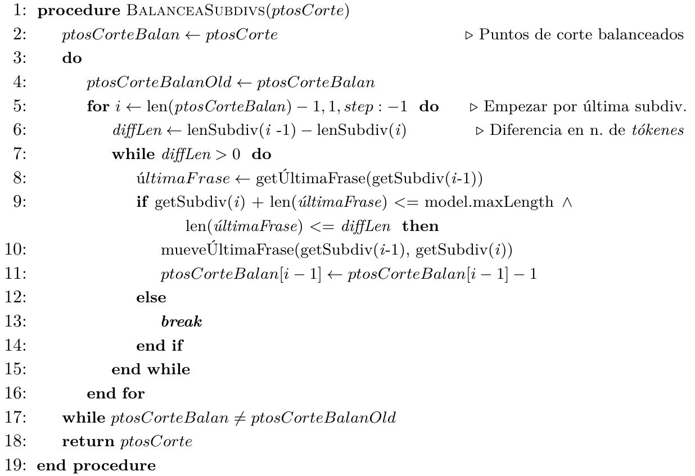
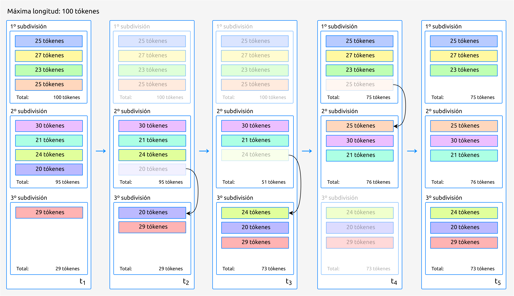
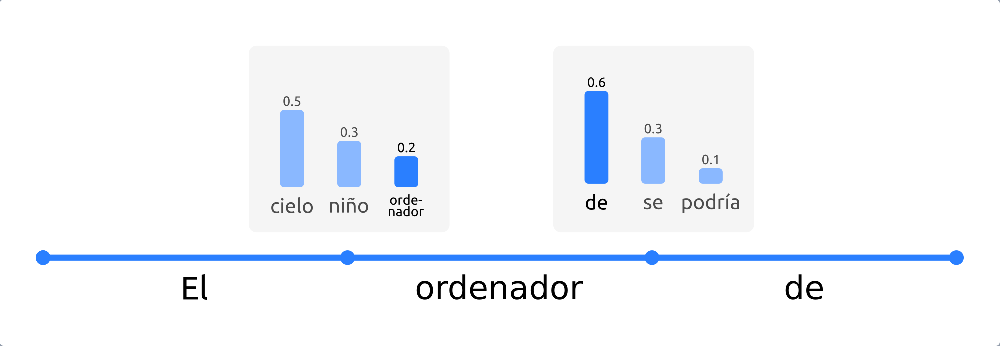
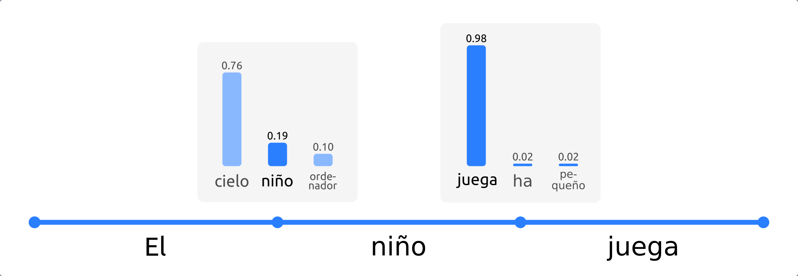
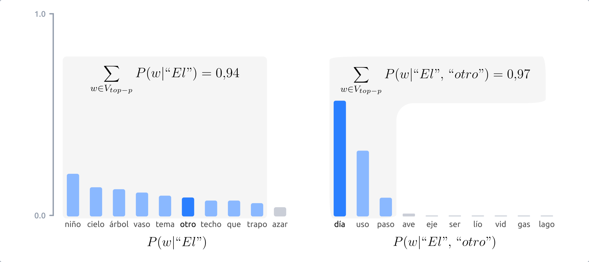

.. _chapter:conceptos-teoricos:

========
Conceptos teóricos
========

En este capítulo, detallaremos de forma teórica el proceso de generación
de resúmenes, desde el momento que recibimos el texto a resumir, hasta
que se le entrega al usuario el resumen generado. En el
:doc:`siguiente capítulo <./4_Tecnicas_y_herramientas>`, explicaremos
las herramientas que hacen posible que todo este proceso se pueda llevar
a cabo de forma distribuida «en la nube».

La generación de resúmenes se divide en cuatro etapas fundamentales:

#. **Pre-procesado**: en esta etapa, se realizan pequeñas modificaciones
   sobre el texto de entrada para adecuarlo a la entrada que el modelo
   de generación de resúmenes espera.

#. **Codificación**: dicho modelo no «entiende» las palabras como tal.
   Por tanto, es necesario convertir texto de entrada a vectores
   numéricos, con los cuales el modelo ya sí que puede trabajar.

#. **Generación del resumen**: en esta etapa es cuando se produce la
   generación del resumen propiamente dicha.

#. **Post-procesado**: por último, el texto final producido por el
   modelo puede que contenga pequeños defectos. Por ejemplo, algunos
   modelos no son capaces de escribir mayúsculas. En esta etapa, se
   trata de solucionar este tipo de problemas, lo que involucra aspectos
   como el Reconocimiento de Entidades Nombradas (NER), que explicaremos
   más adelante.

En la siguiente figura se muestran gráficamente estas cuatro etapas.

.. figure:: ../_static/images/memoria_y_anexos/etapas-resumen.png
   :alt: Etapas en la generación de resúmenes.
   :name: fig:etapas-resumen
   :align: center

   Etapas en la generación de resúmenes.

Una vez hemos adquirido una idea general del proceso, veamos en detalle
en qué consiste cada una de las etapas.

.. _sec:preprocesado:

Pre-procesado del texto
=======================

El principal objetivo de esta etapa es adecuar el texto de entrada para
que se aproxime lo máximo posible a lo que el modelo espera.
Adicionalmente, se separa en texto de entrada en frases. Esta separación
puede parecer *a priori* una tarea trivial, pero involucra una serie de
dificultades que se detallarán a continuación.

Cabe destacar que, como mencionábamos en la :ref:`introduccion`, los modelos pre-entrenados
de los que hacemos uso solo admiten textos en inglés, por lo que algunas
de las consideraciones que tomamos en el pre-procesado del texto podrían
no ser aplicables a otros idioma.

A grandes rasgos, la etapa de pre-procesado se divide a su vez en los
siguientes pasos:

-  Eliminar retornos de carro, tabuladores (``\n``, ``\t``) y espacios
   sobrantes entre palabras (p. ej. ``“I    am”`` :math:`\rightarrow`
   ``“I am”``).

-  Añadir un espacio al inicio de las frases intermedias (p. ej.:
   ``“How’s it going?Great!”`` :math:`\rightarrow`
   ``“How’s it going? Great!”``. Esto es especialmente relevante en el
   caso de algunos modelos, como por ejemplo BART [lewis19]_, los cuales tienen en cuenta ese espacio inicial para
   distinguir entre frases iniciales y frases intermedias en la
   generación de resúmenes\ [1]_.

-  Establecer un mecanismo que permita llevar a cabo la ya mencionada
   separación del texto en frases. Esto es importante dado que los
   modelos presentan un tamaño de entrada máximo. Dos estrategias
   comunes para eludir esta limitación consisten en (a) truncar el texto
   de entrada, lo cual puede llevar asociado pérdidas notables de
   información, o (b) dividir el texto en fragmentos de menor tamaño. En
   nuestro caso, la primera opción quedó rápidamente descartada ya que
   los textos que vamos a recibir, por lo general, superarán el tamaño
   máximo permitido (en caso contrario tendría poco sentido querer
   generar un resumen). Refiriéndonos, por tanto, a la segunda opción,
   es frecuente llevar a cabo dicha separación de manera «ingenua»,
   únicamente atendiendo al tamaño de entrada máximo. Sin embargo, en
   nuestro caso decidimos refinar este proceso e implementamos un
   algoritmo original\ [2]_ en el que dicha separación se realiza de tal
   modo que ninguna frase queda dividida. Para garantizar el éxito de
   este algoritmo, es fundamental que las frases estén correctamente
   divididas; el porqué se clarificará en la :ref:`siguiente sección
   <sec:codificacion>`, referente a la
   codificación del texto, en la que también se incluye la
   implementación concreta del algoritmo.

A continuación, nos centraremos en el proceso de división del texto en
frases. A la hora de llevar a cabo este proceso, debemos tener en cuenta
que el texto de entrada podría contener errores ortográficos o
gramaticales, por lo que debemos tratar de realizar el mínimo número de
suposiciones posibles.

No obstante, la siguiente consideración se nos hace necesaria: el punto
(.) indica el final de una frase solo si la siguiente palabra empieza
con una letra *y* además mayúscula.

Por ejemplo, en el caso de:
``“Your idea is interesting. However, I would [...].”`` se separaría en
dos frases, dado que la palabra posterior al punto empieza con una letra
mayúscula. Sin embargo:
``“We already mentioned in Section 1.1 that this example shows [...].”``
conformaría una única frase, ya que tras el punto no aparece una letra.
Procedemos de igual modo en el caso de los signos de interrogación (?) y
de exclamación (!). Por ejemplo:
``“She asked ‘How’s it going?’, and I said ‘Great!’.”`` se tomará
correctamente como una sola frase; tras la interrogación, la siguiente
palabra comienza con una letra *minúscula*.

Con la consideración anterior, también se agruparían correctamente los
puntos suspensivos.

Sin embargo, fallaría en situaciones como:
``“NLP (i.e. Natural Language Processing) is a subfield of Linguistics, Computer Science, and Artificial Intelligence.”``,
en la que la división sería: ``“NLP (i.e.”`` por un lado, y
``“Natural Language Processing) is a subfield [...].”``, por otro, ya
que ``“Natural”`` comienza con mayúscula y aparece tras un punto.

Asimismo, la razón principal por la que no podemos apoyarnos únicamente
en reglas predefinidas, reside en las llamadas Entidades Nombradas
(*Named Entities*, en inglés). Esto es, palabras que hacen referencia a
personas, lugares, instituciones, corporaciones, etc. Si empleáramos
reglas predefinidas, podríamos incluir en un diccionario todas las
entidades nombradas existentes conocidas que contengan puntos, de forma
que si aparecieran en el texto las palabras ``“U.K.”`` o ``“A.W.O.L.”``
las agruparíamos como tal, sin partir la frase. Sin embargo, existen
potencialmente miles (o incluso decenas de miles) de entidades nombradas
que contienen puntos, por lo que crear y mantener manualmente dicho
diccionario sería muy costoso.

Actualmente, para resolver este tipo de problemas, se emplean modelos
estadísticos o de *Deep Learning*. Esta disciplina se conoce como
Reconocimiento de Entidades Nombradas (NER, por sus siglas en inglés), y
pese a los buenos resultados conseguidos por algunos de los modelos
propuestos, se considera un problema lejos de estar resuelto [ner20]_.

En nuestro caso emplearemos un modelo pre-entrenado para solucionar, al
menos en parte, el problema de las Entidades Nombradas. Este modelo
también solventa situaciones como la descrita anteriormente, en las que
las reglas escritas a mano se quedan cortas. En el capítulo de
:ref:`chapter:tecnicas-herramientas`,
hablaremos de dicho modelo y de la implementación concreta en código de
los procedimientos expuestos anteriormente.

.. _sec:codificacion:

Codificación del texto
======================

En esta etapa, se lleva a cabo lo que se conoce en inglés como *word
embedding*\ [3]_. Los modelos de IA trabajan, por lo general, con
representaciones númericas. Por ello, las técnicas de *word embedding*
se centran en vincular texto (bien sea palabras, frases, etc.), con
vectores de números reales [manning19]_. Esto hace
posible aplicar a la generación de texto arquitecturas comunes dentro de
la IA (y especialmente, del *Deep Learning*), como por ejemplo las Redes
Neuronales Convolucionales (CNN) [hou20]_.

Esta idea, conceptualmente sencilla, encierra una gran complejidad, dado
que los vectores generados deben retener la máxima información posible
del texto original, incluyendo aspectos semánticos y gramaticales. Por
poner un ejemplo, los vectores correspondientes a las palabras
«profesor» y «alumno», deben preservar cierta relación entre ambos,
y a su vez con la palabra «educación» o «escuela». Además, su
vínculo con las palabras «enseñar» o «aprender» será ligeramente
distinto, dado que en este caso se trata de una categoría gramatical
diferente (verbos, en vez de sustantivos). A través de este ejemplo,
podemos comprender que se trata de un proceso complejo.

Dado que los modelos pre-entrenados se encargan de realizar esta
codificación por nosotros, no entraremos en más detalle en los
algoritmos concretos empleados, dado que consideramos que queda fuera
del alcance de este trabajo\ [4]_.

Lo que sí hemos tenido que implementar en esta etapa, ha sido la
división del texto en fragmentos a fin de no superar el tamaño máximo de
entrada del modelo.

De este modo, podremos realizar resúmenes de textos arbitrariamente
largos, a través de los siguientes pasos:

#. Dividimos el texto en fragmentos.

#. Generamos un resumen de cada fragmento.

#. Concatenamos los resúmenes generados.

Anteriormente, habíamos mencionado el término *token*. Este concepto se
puede traducir al español como «símbolo». En nuestro caso concreto, un
*token* se corresponde con el vector numérico asociado a una palabra al
realizar la codificación. Más concretamente, en modelos más actuales,
como el modelo T5 [raffel19]_, el cual empleamos, los
*tókenes* pueden referirse a palabras completas o a *fragmentos* de las
mismas.

Por lo general, las palabras que aparecen en el vocabulario con el que
ha sido entrenado el modelo van a generar un único *token*. Sin embargo,
las palabras desconocidas, se descompondrán en varios *tókenes*. Lo
mismo sucede con palabras compuestas, o formadas a partir de prefijación
o sufijación. En la siguiente figura, podemos ver un ejemplo de ello:

.. figure:: ../_static/images/memoria_y_anexos/t5-tokenizer.png
   :alt: Ejemplo de *tokenización* con el modelo T5.
   :name: fig:t5-tokenizer
   :align: center

   Ejemplo de *tokenización* con el modelo T5.

En el ejemplo mostrado, si decodificamos los *tókenes* correspondientes
a la palabra ``“brutality”``, esto es, ``[14506, 485]``, obtenemos los
fragmentos ``“brutal”`` e ``“ity”``, respectivamente. Análogamente, la
palabra ``“backbone”``, se descompone, una vez decodificados los
``tókenes``, en ``“back”`` y ``“bone”``.

La idea detrás de esta fragmentación se basa en la composición, uno de
los mecanismos morfológicos de formación de palabras más frecuentes
[cetnarowska05]_ en muchos idiomas, como el inglés,
español o alemán. Por tanto, presupone que dividiendo las palabras
desconocidas en fragmentos menores, podemos facilitar la comprensión de
las mismas. Naturalmente, habrá casos en los que esta idea falle; por
ejemplo, en la figura anterior, la palabra ``“JIZT”`` se descompone en
``“J”``, ``“IZ”``, ``“T”``, lo cual no parece hacerla mucho más
comprensible.

Una vez explicado el concepto de *token*, volvamos al problema ya
mencionado con anterioridad: algunos modelos de generación de texto
(entre ellos, el T5) admiten un tamaño de entrada máximo, determinado en
función del número de *tókens*. Debido a que la unidad de medida es el
número de *tókenes*, y no el número de palabras, o de caracteres,
debemos tener en cuenta algunos detalles adicionales, entre ellos el
hecho de que los modelos generan *tókenes* especiales para marcar el
inicio y/o el final de la secuencia de entrada.

El modelo T5 (el cual como mencionábamos anteriormente, es el único
modelo que utilizamos por ahora), genera un único *token* de
finalización de secuencia (EOS, *end-of-sequence*), que se coloca
siempre al final del texto de entrada, una vez codificado, y en el caso
de de este modelo siempre tiene el *id* 1. En la siguiente figura
se presenta un pequeño ejemplo con un texto de entrada:

.. figure:: ../_static/images/memoria_y_anexos/t5-eos-ejemplo.png
   :alt: Pasaje del libro *A Wrinkle in Time*. El *tóken* EOS se ha marcado en rojo.
   :name: fig:t5-eos-ejemplo
   :align: center

   Pasaje del libro *A Wrinkle in Time*. El *tóken* EOS se ha marcado en
   rojo.

Como podemos ver, el *tóken* EOS aparece una única vez por cada texto de
entrada, y es independiente de las palabras o frases que este contiene.

Otro aspecto a tener en cuenta, reside en que este modelo no solo es
capaz de generar resúmenes, si no que puede ser empleado para otras
tareas como la traducción, respuesta de preguntas [raffel19]_, etc.
Para indicarle cuál de estas es la tarea que queremos
que desempeñe, curiosamente se lo tenemos que indicar tal y cómo lo
haríamos en la vida real; en nuestro caso, simplemente precedemos el
texto a resumir con la orden «resume» («*summarize*»). Por poner
otro ejemplo, si quisiéramos traducir del alemán al español, le
señalaríamos: «traduce de alemán a español» («*translate German to
Spanish*») seguido de nuestro texto.

Por consiguiente, este prefijo deberá aparecer al principio de cada una
de las subdivisiones generadas y, del mismo modo, deberemos tenerlo en
cuenta a la hora de calcular el número de *tókenes* de las mismas.

Con las anteriores consideraciones en mente, el objetivo principal será
llevar a cabo la división del texto de entrada de forma que el número de
*tókenes* varíe lo mínimo posible entre las diferentes subdivisiones, y
todo ello sin partir ninguna frase.

Esta es una tarea más compleja de lo que puede parecer. En nuestro caso,
hemos propuesto un :ref:`algoritmo <fig:algoritmo-1>` que emplea una
estrategia voraz para llevar a cabo
una primera división del texto; posteriormente procede al *balanceo* de
las subdivisiones generadas en el paso anterior, de forma que el número
de *tókenes* en cada subdivisión sea lo más parecido posible. Y esto,
evidentemente, sin superar el máximo tamaño de entrada del modelo en
ninguna de las subdivisiones.

.. figure:: ../_static/images/memoria_y_anexos/algoritmo-1.png
   :alt: División y codificación del texto.
   :name: fig:algoritmo-1
   :align: left

   División y codificación del texto.

Este algoritmo devuelve las subdivisiones en las que se ha separado el
texto, ya codificadas. Por tanto, :math:`subdivsCodif` tendrá la
siguiente forma:

``[[23, 34, 543, 45, ..., 1], [23, 32. 401, 11, ..., 1], [23, 74. 25, 204, ..., 1], ...]``

Es decir, cada una de las listas contenidas en :math:`subdivsCodif`
contiene los *tókenes* correspondientes a dicha subdivisión, con el
prefijo (23) y el *token* EOS (1) añadidos.

La lógica detrás de la función :math:`divideVoraz` es la siguiente:

.. figure:: ../_static/images/memoria_y_anexos/algoritmo-2.png
   :alt: División voraz del texto.
   :name: fig:algoritmo-2
   :align: left

   División voraz del texto.

En este algoritmo, :math:`ptosCorte` será una lista que indique los
índices que delimitan cada subdivisión, por ejemplo:

``[0, 45, 91, 130, 179, 190]``

En este caso, la primera subdivisión iría desde la frase 0 hasta la 45,
la segunda subdivisión de la 46 a la 91, la tercera de la 92 a la 130, y
así sucesivamente.

Como podemos ver en el ejemplo, el número de *tókenes* por subdivisión
está en torno a los 45, menos en la última subdivisión que solo contiene
10 *tókenes* (190 - 180). Debido a la propia naturaleza del
algoritmo voraz, será siempre la última subdivisión la que pueda
contener un número de *tókenes* muy por debajo de la media, lo que puede
causar que el resumen de está última subdivisión sea demasiado corto (o
incluso sea la cadena vacía). Para evitar esto, balanceamos las
subdivisiones, de forma que el número de *tókenes* en cada una de ellas
esté equilibrado. Este proceso se muestra a continuación:

   Balanceo de las subdivisiones.

En esencia, lo que este último algoritmo hace es comparar la diferencia
en número de *tókenes* entre subdivisiones consecutivas, empezando por
el final, de forma que primero se compara la penúltima con la última
subdivisión, después la antepenúltima con la penúltima, y así
sucesivamente. Si es necesario, va moviendo frases completas desde una
subdivisión a la siguiente, por ejemplo, desde la penúltima a la última
subdivisión. Este algoritmo tiene una complejidad en el peor de los
casos de :math:`O(n^3)`, siendo :math:`n` el número de subdivisiones.

Podemos visualizarlo gráficamente con un ejemplo muy simple:

   Ejemplo gráfico del algoritmo de balanceo. En este caso, la longitud
   máxima de cada subdivisión es de 100 *tókenes*. Las desviación
   estándar del número de *tókenes* de cada frase en :math:`t_1` es
   :math:`\sigma_1 = 39.63` y en :math:`t_5`, acaba siendo
   :math:`\sigma_5 = 1.53`.

.. _sec:resumen:

Generación del resumen
======================

Una vez codificado y dividido el texto apropiadamente, generamos los
resúmenes parciales para posteriormente unirlos, dando lugar a un único
resumen del texto completo.

En la figura mostrada a continuación, podemos ver los pasos llevados a cabo tanto en
la anterior etapa, la codificación y división del texto, como en esta, la generación
del resumen.

.. figure:: ../_static/images/memoria_y_anexos/t5-proceso-resumen.png
   :alt: Proceso de generación de resúmenes, ilustrado con un fragmento del libro *The Catcher in the Rye*.
   :name: fig:proceso-resumen

   Proceso de generación de resúmenes, ilustrado con un fragmento del
   libro *The Catcher in the Rye*.

Como podemos apreciar en la anterior figura, el modelo generador de
resúmenes toma el texto codificado, y devuelve una versión reducida del
mismo, también codificado. Por ello, antes de poder unir y devolver el
resumen generado, debemos realizar un paso de *decodificación*, esto es,
el proceso contrario a la *codificación*. Algo con lo que tendremos que
lidiar en la siguiente etapa, el post-procesado, será corregir el
resumen generado para que se ajuste a las reglas ortográficas vigentes,
en especial en lo relativo al uso de mayúsculas.

La ventaja de utilizar modelos pre-entrenados es clara: estos modelos
son para nosotros cajas negras, a las que solo tenemos que encargarnos
de proporcionarles la entrada en el formato concreto que esperan.

Cabe destacar que el hecho de realizar la división del texto de esta manera, sin
atender a aspectos semánticos, podría resultar en que frases estrechamente
relacionadas acabaran en distintas subdivisiones. Por ejemplo, en la :ref:`anterior
figura <fig:proceso-resumen>`, la frase final de uno de las subdivisiones es: *«It was
a very descriptive subject»* («Era un tema muy descriptivo»), a la cual le sigue, ya
en la siguiente subdivisión: *«It really was»* («De veras que lo era»), aludiendo a la
anterior frase.

Estos casos son difíciles de resolver. Una posible idea sería tratar de
determinar si una frase está relacionada con la anterior, quizás
mediante el uso de otro modelo, y de ser así, tratar de mantenerlas en
una misma subdivisión, a fin de que el resumen final mantuviese la
máxima cohesión y coherencia posibles. Esto incrementaría, no obstante,
los tiempos de generación de resúmenes. Por ahora, creemos que los
resultados obtenidos son lo suficientemente buenos.

Modelo empleado para la generación de resúmenes: T5
~~~~~~~~~~~~~~~~~~~~~~~~~~~~~~~~~~~~~~~~~~~~~~~~~~~

Come hemos mencionado previamente, JIZT hace uso del modelo T5 de
Google. Este modelo fue introducido en el artículo *Exploring the Limits
of Transfer Learning with a Unified Text-to-Text Transformer* [raffel19]_, presentado en 2019. En él, Colin Raffel *et al.*
estudian las ventajas de la técnica del aprendizaje por transferencia
(*transfer learning*) al campo del Procesamiento del Lenguaje Natural
(NLP).

Tradicionalmente, cada nuevo modelo se entrenaba desde cero. Esto ha
cambiado con la inclusión del aprendizaje por transferencia;
actualmente, la tendencia es emplear modelos pre-entrenados como punto
de partida para la construcción de nuevos modelos.

Las tres principales ventajas del empleo del aprendizaje por
transferencia son [sarkar18]_:

-  Mejora del rendimiento de partida. El hecho de comenzar con un modelo
   pre-entrenado en vez de un modelo ignorante (*ignorant learner*),
   proporciona un rendimiento base desde el primer momento.

-  Disminución del tiempo de desarrollo del modelo, consecuencia del
   punto anterior.

-  Mejora del rendimiento final. Esta mejora ha sido estudiada tanto en
   el caso del NLP [kumar21]_, como de otros ámbitos, como
   la visión artificial [ali21]_, o el campo de la medicina
   [liu21]_.

La principal novedad de este artículo se encuentra en su propuesta de
tratar todos los problemas de procesamiento de texto como problemas
texto a texto (*text-to-text*), es decir, tomar un texto como entrada, y
producir un nuevo texto como salida. Esto permite crear un modelo
general, al que han bautizado como T5, capaz de llevar a cabo diversas
tareas de NLP, como muestra el siguiente diagrama:

.. figure:: ../_static/images/memoria_y_anexos/t5-paper.png
   :alt: El *framework* texto a texto permite emplear el mismo modelo, con los mismos hiperparámetros, función de pérdida, etc., para aplicarlo a diversas tareas de NLP [raffel19]_. En esta figura, además de la traducción y el resumen, se recogen tareas basadas en el *Semantic Textual Similarity Benchmark* (STS-B) y el
   *Corpus of Linguistic Acceptability* (CoLA).

   El *framework* texto a texto permite emplear el mismo modelo, con los
   mismos hiperparámetros, función de pérdida, etc., para aplicarlo a
   diversas tareas de NLP [raffel19]_. En esta figura,
   además de la traducción y el resumen, se recogen tareas basadas en el
   *Semantic Textual Similarity Benchmark* (STS-B) y el *Corpus of
   Linguistic Acceptability* (CoLA).

En cualquier caso, se puede realizar un ajuste fino del modelo para una
de las tareas, a fin de mejorar su rendimiento en esa tarea en
específico.

Las posibilidades que este modelo nos ofrece son muy interesantes, dado
que en un futuro, nuestro proyecto podría incluir otras tareas de
Procesamiento de Lenguaje Natural, haciendo uso de un único modelo.

.. _subsec:estrategias-gen:

Principales estrategias de generación de resúmenes
~~~~~~~~~~~~~~~~~~~~~~~~~~~~~~~~~~~~~~~~~~~~~~~~~~

JIZT permite al usuario avanzado configurar de manera precisa los
parámetros con los que se genera el resumen. En este apartado,
exploraremos las diferentes técnicas con las que se pueden generar
resúmenes.

La generación de lenguaje, en general, se basa en la auto-regresión, la
cual parte del supuesto de que la distribución de probabilidad de una
secuencia de palabras puede descomponerse en el producto de las
distribuciones de probabilidades condicionales de las palabras sucesivas
[platen20]_. Expresado matemáticamente, de manera más
concisa:

.. math:: P(w_{1:t} | W_0) = \prod_{t=1}^{T} P(w_t | w_{1:t-1}, W_0), \; siendo \enspace w_{1:0} = \emptyset

donde :math:`W_0` es la secuencia inicial de *contexto*. En nuestro
caso, esa secuencia inicial va a ser el propio texto de entrada. La
longitud de :math:`T` no se puede conocer de antemano, dado que se
corresponde con el momento :math:`t = T` en el que el modelo genera el
*token* de finalización de secuencia (EOS), mencionado anteriormente.

Una vez introducido el concepto de auto-regresión, podemos explicar
brevemente las cinco principales estrategias de generación de lenguaje,
las cuales se pueden aplicar todas ellas a la generación de resúmenes:
búsqueda voraz, *beam search*, muestreo, muestreo *top-k*, y muestreo
*top-p*.

**Búsqueda voraz**

La búsqueda voraz, en cada paso, selecciona simplemente la palabra con
mayor probabilidad de ser la siguiente, es decir,
:math:`w_t = argmax_w P(w|w_{t-1})` para cada paso *t*.

.. figure:: ../_static/images/memoria_y_anexos/greedy-search.png
   :alt: Ejemplo de búsqueda voraz: en cada paso, se toma la palabra con mayor probabilidad.
   :name: fig:greedy-search
   :width: 70.0%
   :align: center

   Ejemplo de búsqueda voraz: en cada paso, se toma la palabra con mayor
   probabilidad.

Tomando la figura anterior como ejemplo, dada la palabra ``“El”``,
la siguiente palabra elegida sería ``“cielo”``, por ser la palabra con mayor
probabilidad (0.5), y a continuación ``“está”`` (0.5), y así sucesivamente:

Este tipo de generación tiene dos problemas principales:

-  Los modelos, llegados a cierto punto, comienzan a repetir las mismas
   palabras una y otra vez. En realidad, esto es un problema que afecta
   a todos los modelos de generación, pero especialmente a los que
   emplean búsqueda voraz y *beam search* [vijayakumar16, shao17] ..
   [vijayakumar16, shao17]_.

-  Palabras con probabilidades altas pueden quedar enmascaradas tras
   otras con probabilidades bajas. Por ejemplo, en el anterior anterior
   ejemplo, la secuencia ``“El niño juega”`` nunca se dará, porque a
   pesar de que ``“juega”`` presenta una probabilidad muy alta (0.9),
   está precedida por ``“niño”``, la cual no será escogida por tener una
   probabilidad baja (0.3).

**Beam search**

En este caso, durante el proceso de generación se consideran varios caminos
simultáneamente, y finalmente se escoge aquel camino que presenta una mayor
probabilidad conjunta. En la siguiente figura se ilustra un ejemplo con dos caminos
(``num_beams = 2``):

.. figure:: ../_static/images/memoria_y_anexos/beam-search.png
   :alt: Ejemplo de *beam search* con ``n_beams = 2``. Durante la búsqueda, se consideran los dos caminos con mayor probabilidad conjunta.
   :name: fig:beam-search
   :width: 70.0%
   :align: center

   Ejemplo de *beam search* con ``n_beams = 2``. Durante la búsqueda, se
   consideran los dos caminos con mayor probabilidad conjunta.

En este ejemplo vemos que, aunque ``“cielo”`` presenta mayor
probabilidad que ``“niño”``, la secuencia ``“El niño juega”`` tiene una
mayor probabilidad conjunta (:math:`0.3 \cdot 0.9 = 0.27`) que
``“El cielo está”`` (:math:`0.5 \cdot 0.5  = 0.25`), y por tanto será la
secuencia elegida.

Este tipo de búsqueda funciona muy bien en tareas en las que la longitud
deseada de la secuencia generada se conoce de antemano, como es el caso
de la generación de resúmenes, o la traducción automática [murray18]_ [yang18]_.

Sin embargo, presenta dos problemas fundamentales:

-  De nuevo, aparece el problema de la repetición. Tanto en este caso,
   como en el de la búsqueda voraz, una estrategia común para evitar
   dicha repetición, consiste en establecer penalizaciones de *n-gramas*
   repetidos. Por ejemplo, en el caso de que empleáramos una
   penalización de 6-gramas, la secuencia
   ``“El niño juega en el parque”`` solo podría aparecer una vez en el
   texto generado.

-  Como se razona en [holtzman20]_, el lenguaje humano
   no sigue una distribución de palabras con mayor probabilidad. Como vemos en la
   figura recogida a continuación, extraída de dicho artículo, la
   estrategia de *beam search* puede resultar poco espontánea, dando lugar a textos
   menos «naturales».

   .. figure:: ../_static/images/memoria_y_anexos/beam-search-problem.png
      :alt: Distribución de probabilidades del lenguaje natural frente a la estrategia de *beam search* [holtzman20]_.
      :name: fig:natural-beam-search
      :width: 70.0%
      :align: center

      Distribución de probabilidades del lenguaje natural frente a la
      estrategia de *beam search* [holtzman20]_.

**Muestreo**

Es su forma más básica, el muestreo simplemente consiste en escoger la
siguiente palabra :math:`w_i` de manera aleatoria en función de la
distribución de su probabilidad condicional, es decir:

.. math:: w_t \sim P(w_t | w_{1:t-1})

De manera gráfica, siguiendo con el ejemplo anterior:

   Ejemplo de muestreo. En cada paso, se elige una palabra
   aleatoriamente en función de su probabilidad.

Haciendo uso del muestreo, la generación deja de ser determinista, dando
lugar a textos más espontáneos y naturales. Sin embargo, como se estudia
en [holtzman20]_, esta espontaneidad es a menudo
excesiva, dando lugar a textos poco coherentes.

Una solución a este problema consiste en hacer que la distribución
:math:`P(w_t|w_{1:t-1})` sea más acusada, aumentando la verosimilitud
(*likelihood*) de palabras con alta probabilidad, y disminuyendo la
verosimilitud de palabras con baja probabilidad. Esto se consigue
disminuyendo un parámetro denominado *temperatura*\ [5]_. De esta
forma, el ejemplo mostrado en la queda de la siguiente forma:

   Al decrementar la temperatura, las diferencias en las probabilidades
   se hacen más acusadas.

Con este ajuste de la temperatura, logramos reducir la aleatoriedad,
pero seguimos manteniendo una orientación no determinista.

**Muestreo top-k**

En este tipo de muestreo, introducido en [fan18]_, en cada
paso solo se consideran las *k* palabras con mayor probabilidad (la
probabilidad del resto de las palabras será 0):

.. figure:: ../_static/images/memoria_y_anexos/top-k.png
   :alt: Ejemplo de muestreo *top-k*. En cada paso, solo se consideran las 6 palabras con mayor probabilidad.
   :name: fig:top-k

   Ejemplo de muestreo *top-k*. En cada paso, solo se consideran las 6
   palabras con mayor probabilidad.

Tanto la búsqueda voraz como el muestreo «puro», visto anteriormente,
se pueden como ver casos particulares del muestreo *top-k*. Si
establecemos :math:`k = 1`, estaremos realizando una búsqueda voraz, y
si establecemos :math:`k = N`, donde :math:`N` es la longitud total del
vocabulario, estaremos llevando a cabo un muestreo puro.

Este tipo de muestreo suele producir textos de mayor calidad en situaciones en las que
el tamaño de secuencia no está prefijado. Sin embargo, presenta el problema de que el
tamaño de *k* se mantiene fijo a lo largo de la generación. Como consecuencia, en
pasos en los que la diferencia de probabilidades sea menos acusada, como en el primer
paso de la :ref:`anterior figura <fig:top-k>`, la espontaneidad del modelo será menor;
y en pasos en los que ocurra lo contrario, el modelo será más propenso de escoger
palabras que suenen menos naturales, como podría haber ocurrido en el segundo paso de
la figura ya mencionada.

**Muestreo top-p**

Este tipo de muestreo, en vez de escoger entre un número prefijado de
palabras, en cada paso considera el mínimo conjunto de palabras cuyas
probabilidades acumuladas superan un cierto valor :math:`p` [holtzman20]_.

   Con el muestreo *top-p*, el número de palabras entre las cuales
   elegir en cada paso varía en función de las probabilidades de las
   palabras candidatas.

La figura anterior muestra como, con :math:`p=0.9`, en el primer paso se consideran 9
palabras, mientras que en el segundo solo 3. De este modo, cuando la siguiente palabra
a elegir es menos predecible, el modelo puede considerar más candidatas, como en el
primer paso del ejemplo mostrado y, en el caso contrario, el número de palabras
candidatas se reduce.

Los resultados del muestreo *top-k* y *top-p* son, en la práctica,
similares. De hecho, se pueden utilizar de manera conjunta, a fin de
evitar la selección de palabras con probabilidades muy bajas, pero
manteniendo cierta variación en el número de palabras consideradas.

.. _sec:postprocesado:

Post-procesado del texto
========================

Como veíamos en la :ref:`figura del comienzo del capítulo <fig:etapas-resumen>`, el
resumen producido por el modelo T5, una vez decodificado, se encuentra íntegramente en
minúsculas. Por lo demás, el modelo parece hacer un buen trabajo a la hora de generar
el texto en lo que a colocación de puntuación y espacios se refiere, luego la
principal labor de esta etapa será poner mayúsculas allí donde sean necesarias. Este
proceso se denomina en inglés *truecasing* [lita03]_.

Las mayúsculas, tanto en inglés como español, se emplean principalmente
en dos situaciones:

-  Al inicio de cada frase. Como veíamos en la sección referente al
   :ref:`sec:preprocesado`, la separación de un texto en frases no es, por lo general,
   una tarea trivial. En este caso, podemos reutilizar lo aplicado en dicha
   etapa. Teniendo el resumen generado dividido en frases, podemos
   fácilmente poner la primera letra de cada una de ellas en mayúsculas.

-  En los nombres propios. En este aspecto, de nuevo vuelve a aparecer
   el problema del Reconocimiento de Entidades Nombradas (NER). De modo
   similar a como procedíamos en el pre-procesado, emplearemos un modelo
   estadístico que realiza la labor de *truecasing*.

Tras esta etapa, el resumen está listo para ser entregado al usuario.

.. [1]
   Por el momento, no hacemos uso de este modelo, aunque podría
   incluirse en el futuro.

.. [2]
   Utilizamos el término «original» porque no encontramos ningún
   recurso en el que se tratara este problema, por lo que tuvimos que
   resolverlo sin apoyos bibliográficos. Esto no quiere decir, sin
   embargo, que no se hayan implementado estrategias similares en otros
   problemas diferentes al aquí expuesto.

.. [3]
   En el presente documento, hemos traducido este término como
   «codificación del texto».

.. [4]
   En cualquier caso, el lector curioso puede explorar los algoritmos
   más populares de codificación, los cuales, ordenados
   cronológicamente, son: word2vec [word2vec1]_ [word2vec2]_, GloVe [glove14]_, y más
   recientemente, ELMo [elmo18]_ y BERT [bert18]_.

.. [5]
   Por motivos de brevedad, no incluiremos una explicación detallada de
   este parámetro.

.. [word2vec1]
   Tomas Mikolov y col. Efficient Estimation of Word Representations
   in Vector Space. 2013. arXiv: 1301.3781 [cs.CL].

.. [word2vec2]
   Tomás Mikolov y col. “Distributed Representations of Words and
   Phrases and their Compositionality”. En: CoRR abs/1310.4546 (2013).
   arXiv: 1310.4546. URL:
   `<http://arxiv.org/abs/1310.4546>`__.
   Último acceso: 28/01/2021.

.. [glove14]
   Jeffrey Pennington, Richard Socher y Christopher Manning. “GloVe:
   Global Vectors for Word Representation”. En: Proceedings of the 2014
   Conference on Empirical Methods in Natural Language Processing
   (EMNLP). Doha, Qatar: Association for Computational Linguistics,
   abr. de 2014, págs. 1532-1543. 

.. [elmo18]
   Matthew E. Peters y col. “Deep contextualized word representations”.
   En: CoRR abs/1802.05365 (2018). arXiv: 1802.05365. URL:
   `<http://arxiv.org/abs/1802.05365>`__.
   Último acceso: 28/01/2021.

.. [bert18]
   Jacob Devlin y col. “BERT: Pre-training of Deep Bidirectional Trans-
   formers for Language Understanding”. En: CoRR abs/1810.04805
   (2018). arXiv: 1810 . 04805. URL:
   `<http://arxiv.org/abs/1810.04805>`__.
   Último acceso: 28/01/2021.

.. [lewis19]
   Mike Lewis y col. “BART: Denoising Sequence-to-Sequence Pre-training
   for Natural Language Generation, Translation, and Comprehension”.
   En: CoRR abs/1910.13461 (2019).  arXiv: 1805.04833 [cs.CL]. URL:
   `<http://arxiv.org/abs/1910.13461>`__.
   Último acceso: 28/01/2021.

.. [ner20]
   Wikipedia. Reconocimiento de entidades nombradas - Wikipedia, La
   enciclopedia libre. 2020. URL:
   `<https://es.wikipedia.org/wiki/Reconocimiento_de_entidades_nombradas>`__.
   Último acceso: 28/01/2021.

.. [manning19]
   Christopher Manning - Stanford University. Stanford CS224N: NLP
   with Deep Learning. Winter 2019. Lecture 13. Contextual Word Embed-
   dings. 2019. URL:
   `<https://www.youtube.com/watch?v=S-CspeZ8FHc>`__.
   Último acceso: 28/01/2021.

.. [hou20]
   Linlin Hou y col. Method and Dataset Entity Mining in Scientific
   Literature: A CNN + Bi-LSTM Model with Self-attention. 2020.

.. [raffel19]
   Colin Raffel y col. “Exploring the Limits of Transfer Learning with a
   Unified Text-to-Text Transformer”. En: CoRR abs/1910.10683 (2019),
   pág. 11. arXiv: 1910.10683. URL:
   `<http://arxiv.org/abs/1910.10683>`__.
   Último acceso: 27/01/2020.

.. [sarkar18]
   Dipanjan Sarkar, Raghav Bali y Tamoghna Ghosh. Hands-On Transfer
   Learning with Python. Packt Publishing, 2018. isbn: 9781788831307.

.. [kumar21]
   Manoj Kumar y col. ProtoDA: Efficient Transfer Learning for Few-
   Shot Intent Classification. 2021. arXiv: 2101.11753 [cs.CL].

.. [ali21]
   Nuredin Ali. Exploring Transfer Learning on Face Recognition of
   Dark Skinned, Low Quality and Low Resource Face Data. 2021. arXiv:
   2101.10809 [cs.CV].

.. [liu21]
   Yi Liu y Shuiwang Ji. A Multi-Stage Attentive Transfer Learning
   Framework for Improving COVID-19 Diagnosis. 2021. arXiv: 2101.
   05410 [eess.IV].

.. [platen20]
   Patrick von Platen. How to generate text: using different decoding
   methods for language generation with Transformers. Mar. de 2020. URL:
   `<https://huggingface.co/blog/how-to-generate>`__.
   Último acceso: 31/01/2021.

.. [murray18]
   Kenton Murray y David Chiang. “Correcting Length Bias in Neural
   Machine Translation”. En: CoRR abs/1808.10006 (2018). arXiv: 1808.
   10006. URL:
   `<http://arxiv.org/abs/1808.10006>`__.
   Último acceso: 31/01/2021.

.. [yang18]
   Yilin Yang, Liang Huang y Mingbo Ma. “Breaking the Beam Search
   Curse: A Study of (Re-)Scoring Methods and Stopping Criteria for
   Neural Machine Translation”. En: CoRR abs/1808.09582 (2018). arXiv:
   1808.09582. URL:
   `<http://arxiv.org/abs/1808.09582>`__.
   Último acceso: 31/01/2021.

.. [holtzman20]
   Ari Holtzman y col. The Curious Case of Neural Text Degeneration.
   2020. arXiv: 1904.09751 [cs.CL].

.. [fan18]
   Angela Fan, Mike Lewis y Yann Dauphin. Hierarchical Neural Story
   Generation. 2018. arXiv: 1805.04833 [cs.CL].

.. [lita03]
   Lucian Vlad Lita y col. “TRuEcasIng”. En: Proceedings of the 41st
   Annual Meeting on Association for Computational Linguistics - Volume
   1. ACL ’03. Sapporo, Japan: Association for Computational Linguistics,
   2003, págs. 152-159.
