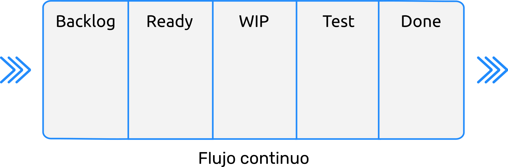
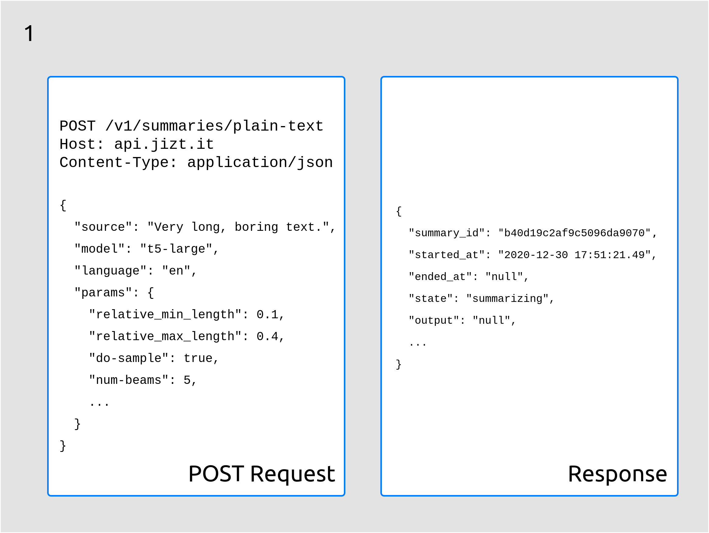
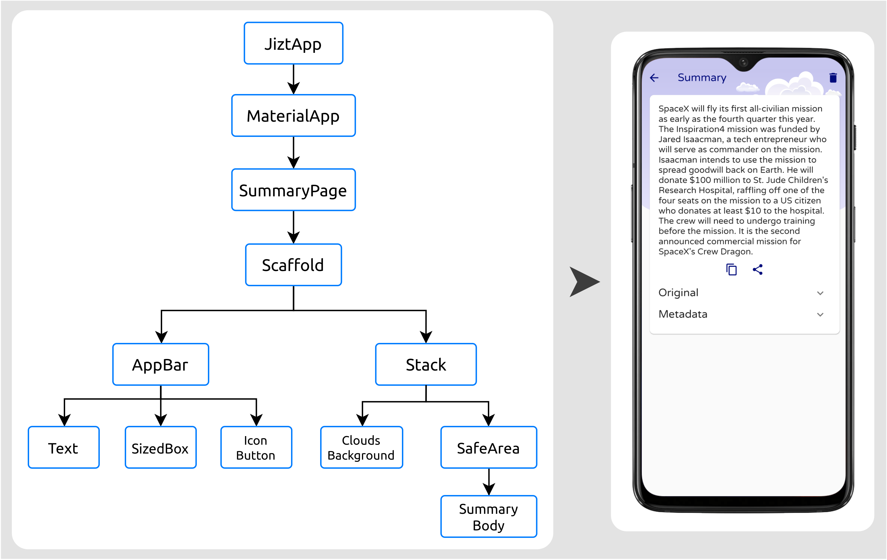

===============================================
Aspectos relevantes del desarrollo del proyecto
===============================================
A la hora de desarrollar el proyecto, nos encontramos con una serie de
decisiones a tomar, retos, y cuestiones que tratamos de solucionar a
través de la formación y la aplicación de mejores prácticas. Esta
labor fue relativamente sencilla gracias a la disponibilidad de
recursos *online* existente hoy en día, así como el entusiasmo y la
participación activa de la comunidad detrás de las herramientas
empleadas en este proyecto.

En este apartado cubrimos los aspectos más destacados en este respecto.

Metodología de desarrollo *software*: Kanban
============================================

El contexto y características en los que se enmarcaba nuestro proyecto
son las siguientes:

-  **Tiempo limitado**: no cabía posibilidad de alargar los plazos, y
   existían importantes restricciones de tiempo (disponíamos de
   aproximadamente cuatro meses para la compleción del proyecto).

-  **Eficiencia y velocidad**: debido a las restricciones mencionadas en
   el punto anterior, la implementación del proyecto había de ser rápida
   y eficiente, asegurando siempre un nivel de calidad óptimo.

-  **Motivación y progreso del proyecto**: requeríamos de una
   metodología que estimulase de manera natural la inversión de tiempo y
   esfuerzo en el proyecto.

-  **Satisfacción de los usuarios**: dado que ellos son la razón por la
   que este proyecto se desarrollaba en primer lugar.

Atendiendo a los puntos descritos anteriormente, decidimos adoptar un
enfoque ágil para el desarrollo de nuestro proyecto. Dentro de las
metodologías ágiles, se consideraron las siguientes:

-  **Scrum**: desarrollo iterativo e incremental centrado en la idea de
   *sprints*, es decir, iteraciones con una duración fija prefijada, al
   final de las cuales se produce una entrega parcial del producto.

-  **Kanban**: esta metodología se centra en mantener un flujo constante
   de trabajo, maximizando la eficencia del equipo de forma que cada
   tarea sea completada con la mayor celeridad posible.

-  **Programación Extrema (XP)**: se centra en producir *software* de la
   mejor calidad posible, siendo una de las metodologías ágiles que más
   profundiza en los aspectos de buenas prácticas de ingeniería para el
   desarrollo de software.

Tras una valoración de las ventajas y desventajas de cada una de estas
metodologías, decidimos adoptar la metodología Kanban, gracias también a
su mayor flexibilidad. Esto resultó de gran ayuda, dado que, al comenzar
este proyecto desconocíamos el funcionamiento concreto de muchas de las
herramientas y técnicas utilizadas, por lo que habría sido muy difícil
producir ciclos de desarrollo predefinidos y cerrados, como en el caso
de Scrum.

No obstante, sí que tomamos ciertos elementos interesantes de esta otra
metodología, Scrum, acercándonos en cierto modo a lo que se conoce como
Scrumban, una metodología híbrida entre Scrum y Kanban.

A continuación, se recogen las principales características de nuestro
sistema de trabajo:

-  Empleamos un tablero Kanban para organizr las historias de usuario, y
   hacemos uso de instrumentos como los límites WIP (*Work In Progress*)
   y de herramientas como los Diagramas de Flujo Acumulado (CFD, por sus
   siglas en inglés).

-  Definimos *epics* para agrupar historias de usuario que conformen una
   misma *feature*, o funcionalidad a desarrollar.

-  Debido a la naturaleza de Kanban, no existen *sprints* como tal: el
   flujo de trabajo es continuo. Sin embargo, sí que se definen tiempos
   estimados para completar cada tarea (sin emplear puntos de historia;
   los tiempos se expresan en número de horas empleadas).

-  Cada tarea tiene asociada una complejidad, que va desde 0 (mínima
   complejidad), hasta 10 (máxima complejidad).

-  Cada tarea tiene asociada una prioridad. Los niveles de prioridad van
   desde 0 hasta 3, siendo esta última la prioridad máxima.

-  Además del *product backlog*, en el que se recogen las futuras
   historias de usuario a desarrollar, contamos con otras cuatro
   columnas: *preparado*, *trabajo en progreso*, *testing*, y
   *finalizado*.

-  Periódicamente, se llevaron a cabo *revisiones* y *retrospectivas*,
   en las que participaron los tutores.

   Tablero Kanban utilizado.

Como herramienta de gestión Kanban, empleamos Kanboard [kanboard]_. Se trata de una
aplicación *web* *open-source* activamente desarrollada. Contratamos un servidor EC2
con Amazon Web Services (AWS) desde el cual podemos servir la aplicación *web* PHP, la
cual a su vez hace uso de una base de datos PostgreSQL en la cual almacena los datos
generados. Dicha base de datos está desplegada a través del servicio RDS, también
perteneciente a1 AWS.

Se puede acceder al tablero público a través de
`https://kanban.jizt.it <https://board.jizt.it/public/board/c08ea3322e2876652a0581e79d6430e2dc0c27720d8a06d7853e84c3cd2b>`__.

.. figure:: ../_static/images/memoria_y_anexos/kanboard.png
   :alt: Captura de pantalla de nuestro tablero Kanban en la aplicación *web* Kanboard.

   Captura de pantalla de nuestro tablero Kanban en la aplicación *web*
   Kanboard.

Motivación tras las arquitecturas desarrolladas
===============================================

Arquitectura de microservicios
------------------------------

Desde un primer momento, se concibió la arquitectura con los siguientes
objetivos presentes:

-  **Flexibilidad**: la Inteligencia Artificial y, en concreto, el
   Procesamiento de Lenguaje Natural, son campos en continuo desarrollo.
   Cada pocos meses aparecen modelos más potentes que proporcionan
   mejores resultados. Es por ello que nuestra arquitectura debe
   proporcionar una estructura lo más desacoplada como sea posible de
   los modelos concretos de NLP que empleados. De este modo, si
   aparecieran modelos más avanzados, la transición de unos modelos a
   otros resultará una labor relativamente sencilla.

-  **Escalabilidad**: los elementos que conforman la arquitectura, deben
   tener la capacidad de replicarse a fin de responder correctamente a
   la demanda de usuarios. Adicionalmente, como se ha venido mencionado
   a lo largo de esta memoria, la implementación de otras tareas de NLP
   diferentes de la generación de resúmenes es algo que entra dentro de
   nuestros planes a medio plazo. La arquitectura debe estar
   estructurada de tal forma que esta expansión se pueda llevar a cabo
   sin inconvenientes.

-  **Alta disponibilidad**: relacionado con el punto anterior, se debe
   poder prestar servicio de forma continua, independientemente de que
   se produzcan picos en la carga de trabajo, o de que alguno de los
   componentes falle en un momento dado.

-  **Cloud native**: este punto engloba a todos los anteriores; los
   sistemas *cloud-native* están diseñados para adaptarse a entornos
   cambiantes, operar a gran escala y poseer resiliencia [cloud20]_.

Una de las arquitecturas que permiten conseguir los objetivos recogidos
anteriormente, es la **arquitectura de microservicios**. Con este patrón
arquitectónico, la aplicación se divide en pequeños servicios, cada uno
de los cuales cumple una labor específica y encapsula todas sus
dependencias, a fin de conseguir el máximo grado de independencia
posible.

En nuestro caso, además, existen tareas que llevan considerablemente más
tiempo que otras, como es el caso de la generación del resumen (que
puede durar segundos), frente al pre-procesado del texto (el cual es
instantáneo). Una arquitectura como esta nos permite replicar el
microservicio encargado de la generación del resumen, a fin de repartir
la carga de trabajo entre las diferentes réplicas. E incluso, podríamos
ejecutar los distintos microservicios en máquinas con prestaciones
diferentes, de forma que, por ejemplo, el Generador de resúmenes se
ejecutara en una máquina más potente, equipada con una GPU, mientras que
el resto de microservicios corrieran en máquinas más convencionales. De
este modo, reduciríamos los cuellos de botella, manteniendo al mismo
tiempo los costes económicos dentro de unos márgenes razonables.

Añadido a todo lo anterior, si uno de los microservicios fallara, sería
reemplazado inmediatamente por una nueva réplica, gracias a la
tecnología de Kubernetes.

Arquitectura dirigida por eventos
---------------------------------

Dado que ya ha sido introducida en la sección referente a :ref:`subsec:kafka`, no
entraremos en mucho detalle para evitar repetirnos.

Simplemente recordaremos que este patrón arquitectónico hace posible la
comunicación entre los microservicios de forma fiable y rápida. En
nuestro caso, un evento sería la finalización del trabajo por parte de
uno de los microservicios. Este evento genera una respuesta en otro de
los microservicios, el cual procesa dicho evento y comienza su labor
específica.

Este patrón nos ofrece también flexibilidad a la hora de introducir
nuevos microservicios, ya que, al menos en el caso de Kafka, el *topic*
al que un microservicio produce (o consume) eventos podría ser
modificado en tiempo de ejecución, sin necesidad de alterar el código
fuente del microservicio.

Finalmente, recordar que el hecho de incrementar el número de réplicas
de los microservicios, no influye en el correcto funcionamiento de
Kafka, el cual gestiona este escalado de manera transparente.

API REST Asíncrona
------------------

La generación de resúmenes es un proceso que se puede dilatar varios
segundos en el tiempo, dependiendo de factores como la longitud del
texto o de los parámetros con los que se genere el resumen. Por lo
tanto, realizar peticiones síncronas queda descartado, puesto que una
petición HTTP no debe prolongarse durante tanto tiempo.

La forma común de solucionar este problema, logrando asincronismo, pasa
por realizar una primera petición dándole a conocer al sistema que
queremos generar un resumen. El sistema, entonces, responderá
haciéndonos saber que la petición ha sido recibida y se está procesando.
A partir de ese momento, consultaremos periódicamente al servidor para
conocer el estado del resumen, hasta finalmente obtenerlo, una vez haya
sido generado.

Veamos el proceso de manera un poco más detallada.

1. Petición HTTP POST
~~~~~~~~~~~~~~~~~~~~~

El cliente comienza realizando una petición POST incluyendo en el cuerpo
de la misma el texto que desea resumir. La API le responde con un
identificador único del resumen, el ``summary_id``, así como otros
campos de interés:

   El primer paso es realizar una petición POST con el texto a resumir.

Como vemos en la anterior figura, el estado del resumen es ``"resumiendo"``
(``"summarizing"``), y aún no tenemos acceso al resumen (``ouput``), el
cual es por el momento ``"null"``.

Una de las principales ventajas de poder consultar el estado del
resumen, es poder ofrecer al usuario retroalimentación de los pasos que
se están llevando a cabo, mostrándole así que su resumen efectivamente
está siendo procesado.

2. Peticiones HTTP GET sucesivas
~~~~~~~~~~~~~~~~~~~~~~~~~~~~~~~~

En ese momento, el cliente puede llevar a cabo peticiones HTTP GET con
el *id* del resumen de manera periódica a fin de consultar el estado del
mismo.

En algún momento, el estado del resumen pasará a ser ``"completado"``
(``"completed"``), y la respuesta a nuestra petición contendrá el
resumen generado, como se ilustra en la siguiente figura:

.. figure:: ../_static/images/memoria_y_anexos/api-request-2.png
   :alt: Finalmente, obtenemos el resumen generado.
   :name: fig:api-segundo-paso

   Finalmente, obtenemos el resumen generado.

En el caso de que previamente se hubiera solicitado un resumen del mismo
texto, con el mismo modelo y parámetros, el resumen ya estaría
almacenado en la base de datos, por lo que la respuesta al primer POST
ya contendría dicho resumen.

Desarrollo de la aplicación
---------------------------

A la hora de desarrollar la aplicación, se ha dado gran importancia al
diseño de una aplicación robusta e intuitiva, pero al mismo tiempo fácil
de mantener y con capacidad para añadir nuevas funcionalidades.

Con estos objetivos en mente, nos decantamos por implementar una
arquitectura de cuatro capas y que se inspira principalmente en los
patrones de *Clean Architecture* [martin15]_ y
*Domain-Driven Design* (DDD) [vernon13]_.

Como resultado, los principios fundamentales de la arquitectura
desarrollada son:

-  División del código de la aplicación en capas: cada capa aísla un
   área de la base de código.

-  Cada capa es estricta con sus dependencias, pudiendo interaccionar
   únicamente con las capas inferiores.

-  Según se avanza hacia capas inferiores, el código se vuelve más
   genérico. De este modo, las capas inferiores dictan políticas y
   reglas, mientras que las capas superiores se encargan de detalles de
   implementación como bases de datos, operaciones de red o la interfaz
   de usuario.

-  La estructura y lenguaje del código se deben basar en el dominio de
   negocio.

La siguiente figura ilustra el patrón de *Clean Architecture*, y se puede aplicar
asimismo a nuestra arquitectura.

.. figure:: ../_static/images/memoria_y_anexos/clean-architecture.jpg
   :alt: Ilustración de *Clean Architecture* [martin15]_. La arquitectura se divide en capas, cada una con unas responsabilidades definidas y acotadas.
   :name: fig:clean-arch
   :width: 80%
   :align: center

   Ilustración de *Clean Architecture* [martin15]_. La
   arquitectura se divide en capas, cada una con unas responsabilidades
   definidas y acotadas.

Estos principios nos garantizan que, aunque los requerimientos,
tecnologías o la interfaz de usuario de la aplicación cambien con el
tiempo, las funcionalidades esenciales de la aplicación no se verán
significativamente afectadas. Además, este aislamiento entre capas nos
proporciona una mayor escalabilidad y capacidad de testeo de nuestro
código.

A continuación, se muestra cómo está conformada la arquitectura de la aplicación. Como
podemos ver, las cuatro capas mencionadas en las que se divide nuestra aplicación son:
Presentación, Aplicación, Datos y Dominio.

.. figure:: ../_static/images/memoria_y_anexos/jizt-app-arch.png
   :alt: Arquitectura de la aplicación.
   :name: fig:app-arch

   Arquitectura de la aplicación.

Expliquemos de forma más detallada cada una de ellas, comenzando por la
capa de *datos*, a la derecha de la imagen.

Capa de datos
~~~~~~~~~~~~~

La capa de datos es la responsable de persistir y cargar modelos de
dominio. En ella se emplea el patrón repositorio, que permite encapsular
y centralizar la lógica de acceso a las fuentes de datos, facilitando el
mantenimiento y desacoplando el resto de capas de la infraestructura y
tecnología que finalmente almacena los datos.

En nuestro caso el repositorio abstrae dos fuentes de datos:

-  Fuente de datos remota: consume la API REST del *backend*.

-  Fuente de datos local: se emplea una base de datos local como caché
   para almacenar los resúmenes generados. Esto permite al usuario
   acceder a su historial de resúmenes.

Además de centralizar el acceso a datos, el repositorio también es
responsable de transformar las diferentes representaciones de los
modelos de dominio con los que trabaja la aplicación utilizando lo que
se conoce como *mappers*. Dichos representaciones son:

-  Modelo de dominio (*domain model*): es la representación de los datos
   a través de la estructura más apropiada para la aplicación junto con
   sus reglas de negocio.

-  DTO (*Data Transfer Object*): se corresponde con la representación de
   los datos en los documentos JSON que se envían y reciben de la API
   REST. Su estructura es la más adecuada para la comunicación remota.

-  Entidad de la base de datos (*database entity*): es la representación
   de los datos en la base datos local. Su estructura es la más adecuada
   para persistir la información en dicha base de datos.

Como consecuencia, el hecho de separar los modelos en estas tres
representaciones diferentes nos permite:

-  Encapsular en los DTOs todas las anotaciones específicas del
   *framework* que nos permite serializar y deserializar los documentos
   JSON.

-  Encapsular en las *database entities* todas las anotaciones que nos
   permiten almacenar objetos en la base de datos.

-  Mantener los *domain models* independientes de cualquier *frameworks*
   específico. De este modo, si en un futuro se reemplaza, por ejemplo,
   el *framework* de serialización de los documentos JSON, la capa de
   dominio no se vería afectada.

-  Cachear localmente la información realmente necesaria (por ejemplo,
   prescindiendo de algunos metadatos que devuelve la API REST y que no
   son relevantes para el usuario de la aplicación, o almacenando
   información adicional que no devuelve la API).

.. figure:: ../_static/images/memoria_y_anexos/repository-pattern.png
   :alt: Patrón repositorio [brandi19]_. En esta imagen se ilustran los diferentes dominios explicados, así como la transformación de los modelos de unos dominios a otros por parte del *Data Mapper*.
   :width: 90.0%
   :align: center

   Patrón repositorio [brandi19]_. En esta imagen se
   ilustran los diferentes dominios explicados, así como la
   transformación de los modelos de unos dominios a otros por parte del
   *Data Mapper*.

Capa de dominio
~~~~~~~~~~~~~~~

Esta capa define la lógica de dominio de la aplicación, y es
independiente de la plataforma de desarrollo, es decir, en nuestro caso
estará escrita puramente en Dart, sin contener ningún elemento de
Flutter [flutter-clean-arch]_. El motivo reside
en que el dominio, como decíamos, solo debe ocuparse de la lógica de
negocio, y no de los detalles de implementación. Esto también permite
una fácil migración entre plataformas, en caso de ser necesario en algún
momento.

La capa de dominio contiene los *domain models* que representan los
conceptos de negocio junto con sus reglas.

Además de los *domain models*, esta capa contiene las definiciones
(interfaces) de los repositorios implementados en la capa de datos. A
través de esta técnica, conocida como inversión de dependencias
(*dependency inversion*), se logra mantener la capa de dominio
totalmente independiente de las demás capas y de los *frameworks* que
estas usan (por ejemplo, Flutter en la capa de presentación o Hive\ [1]_
en la capa de datos), limitando su ámbito estrictamente a la
representación de los conceptos de negocio junto con sus reglas.

Capa de aplicación
~~~~~~~~~~~~~~~~~~

La capa de aplicación contiene toda la lógica de negocio de aplicación
(*application business logic*, no confundir con la *domain business
logic de* la capa de dominio). Esta se encarga principalmente de
orquestar el resto de capas.

En ella utilizamos el patrón BLoC (Business Logic Component)
[miola20]_, se basado en dos elementos principales: eventos
y estados.

Desde fuera podemos imaginarnos un BLoC como una caja negra a la que se
le proporcionan eventos como entrada (por ejemplo "cargar todos los
resúmenes") y el BLoC emite un estado como salida (en el ejemplo
anterior, el nuevo estado incluiría la lista de resúmenes).

En el interior del BLoC se encuentra la lógica de negocio de aplicación
que, dado un evento de entrada, acudirá a la capa de dominio para
recuperar, guardar o validar información, y finalmente actualizará el
estado según el resultado de esas operaciones.

Capa de presentación
~~~~~~~~~~~~~~~~~~~~

La capa de presentación es la más cercana al usuario y se encarga de
dibujar la interfaz de usuario, así como de propagar las interacciones
del usuario a la capa de aplicación. No posee ninguna lógica de negocio;
únicamente presenta lógica de presentación (por ejemplo, cómo pintar un
botón dependiendo de su estado, cómo navegar entre pantallas, cómo
ejecutar una animación, etc.).

En esta capa encontramos todo el código específico de Flutter,
especialmente los *widgets* que componen las vistas finales de la
interfaz [flutter-widget]_, como un botón o un
*layout*. Los *widgets* se organizan de forma jerárquica, de modo que
toda aplicación tendrá un *widget* raíz, del cual «colgarán» el resto
de *widgets*, como podemos ver en la siguiente figura:

   Ejemplo de jerarquía de *widgets* de una aplicación sencilla. Imagen
   del dispositivo móvil extraída de [miola20]_.

Las interacciones del usuario se propagan como eventos a los BLoC de la
capa de aplicación, y estos actualizan su estado acordemente. La capa de
presentación «escucha» dichos estados y, cada vez que estos cambian,
vuelve a dibujar los *widget*, actualizando la pantalla. Cabe mencionar
que Flutter realiza esta operación de una forma muy optimizada,
volviendo a dibujar solamente aquellas partes de la interfaz que han
sido modificadas.

Integración y despliegue continuos (CI/DC)
------------------------------------------

A fin de seguir buenas prácticas en el entorno de DevOps, hemos
implementado integración y despliegue continuos tanto del *backend*,
como de la aplicación.

Anteriormente, el uso de estas técnicas se llevaba a cabo a través de
herramientas de automatización como Jenkins [jenkins]_ o
Travis CI [travis]_.

No obstante, GitHub (en el cual alojamos nuestros repositorios del
proyecto) ha lanzado recientemente su propio servicio con este fin,
llamado GitHub Actions [github-actions]_, que permite
implementar CI/CD directamente desde esta plataforma, sin tener que
hacer uso de aplicaciones de terceros. Esta ha sido, por tanto, la
opción escogida en nuestro caso.

Una de las grandes ventajas de GitHub Actions reside en que existen
«acciones» predefinidas y reutilizables, escritas previamente por
otros usuarios, que llevan a cabo tareas comunes o rutinarias. De este
modo, no necesitamos encargarnos de, por ejemplo, lidiar con todos los
detalles específicos para poder conectarnos a nuestro *clúster* en
Google Cloud desde GitHub Actions, a fin de poder desplegar el *backend*
de forma automática.

Resumamos los principales aspectos del CI/CD en el caso del *backend* y
de la aplicación, los cuales se alojan en dos repositorios diferentes.

CI/CD en el repositorio del *backend*
~~~~~~~~~~~~~~~~~~~~~~~~~~~~~~~~~~~~~

En el caso del *backend*, hemos reservado la rama ``main`` como rama
principal de producción. Por tanto, siempre que trabajamos sobre alguna
mejora o cambio, creamos una nueva para ello. Cuando hemos finalizado de
implementar esos cambios, hacemos un *merge* con la rama principal.

En el momento que esto ocurre, se ponen en funcionamiento las tareas de
GitHub Actions. Lo primero que se lleva a cabo es una ejecución
automática de los *tests* desarrollados para la prueba del *backend*.
Solo en el caso de que todos los *tests* hayan sido exitosos, se procede
a desplegar la nueva versión del *backend* en nuestro *clúster* de
producción de Google Kubernetes Engine (GKE). Esta actualización se
realiza sin tiempos de interrupción, gracias a las ventajas que ofrecen
Kubernetes y Helm, ya explicadas con anterioridad.

**DeepSource - Revisión automatizada del código**

Además de los *tests* implementados, hacemos uso de una herramienta
llamada DeepSource [deepsource]_. Esta herramienta lleva
a cabo análisis estáticos de nuestro código, detectando cualquier
posible error de sintaxis, anti-patrones, problemas potenciales de
seguridad, recomendaciones de estilo, etc.

Hablando personalmente, queremos destacar que la potencia de DeepSource
nos ha sorprendido, dado que es capaz de detectar hasta los detalles más
sutiles, y por tanto nos ha sido de gran ayuda a la hora de potenciar la
calidad de nuestro código.

Se puede hacer uso de DeepSource de manera gratuita durante seis meses
con el *pack* de estudiante de GitHub [gh-student-pack]_.

.. figure:: ../_static/images/memoria_y_anexos/checks-backend.png
   :alt: Tareas llevadas a cabo cada vez que hacemos un *commit* a la rama ``main`` del repositorio. Imagen extraída de GitHub.

   Tareas llevadas a cabo cada vez que hacemos un *commit* a la rama
   ``main`` del repositorio. Imagen extraída de GitHub.

El repositorio en GitHub correspondiente al *backend* es accesible a
través de https://github.com/dmlls/jizt.

CI/CD en el repositorio de la aplicación
~~~~~~~~~~~~~~~~~~~~~~~~~~~~~~~~~~~~~~~~

Para la aplicación, también hacemos uso de GitHub Actions para
implementar el CI/CD de la misma.

En este caso, se llevan a cabo tres tareas principales:

-  QA: cada vez que se hace un *push* desde cualquier rama se ejecutan
   los test, se comprueba que el código está correctamente formateado, y
   se realiza un análisis estático del código. Solo si estas
   comprobaciones son exitosas se llevará a cabo el *merge* de dicha
   rama con la rama principal (``main``).

-  Despliegue de la *web app*: cada vez que la rama principal es
   actualizada, se compila la nueva versión, y se despliega a GitHub
   Pages de manera automática.

-  Despliegue de la *app* Android: la estrategia de despliegue que
   seguimos con la *web* no es ideal para aplicaciones nativas que se
   distribuyen a través de una *store* (por ejemplo, Play Store), ya que
   generaría actualizaciones constantemente. Por este motivo utilizamos
   *tags* de GitHub, que nos permiten lanzar actualizaciones que agrupan
   varios *commits*. Cada vez que se crea una nueva *tag* (por ejemplo,
   ``v0.1.1``), se compila la nueva versión de la aplicación de Android
   y se propaga automáticamente a Google Play.

TODO: añadir captura de los checks de GitHub.

Se puede acceder al repositorio correspondiente a la aplicación de JIZT
en https://github.com/dmlls/jizt-app.

Distribución de la aplicación
-----------------------------

La distribución de la aplicación se lleva a cabo a través de GitHub y,
en su versión Android, también a través de Google Play.

GitHub
~~~~~~

Cada vez que se produce una nueva versión de la aplicación, se crea una
nueva *Release* en GitHub que contiene el código fuente de la
aplicación.

TODO: desarrollar un poco más, añadir alguna captura.

**GitHub Pages**

GitHub Pages es un servicio de *hosting* para páginas *web* estáticas
que nos permite servir nuestra aplicación en su versión *web* de manera
gratuita.

Se puede acceder a la aplicación de JIZT a través de
https://app.jizt.it.

En nuestro caso, también hacemos uso de este servicio para alojar la
*landing page* del proyecto (https://www.jizt.it), así como la
documentación del proyecto (https://docs.jizt.it), y la documentación de
la API REST (https://docs.api.jizt.it).

Play Store
~~~~~~~~~~

La aplicación, en su versión Android, también está disponible a través
de Play Store, de momento únicamente a través del programa *Internal
Early Access*. Esto significa que únicamente aquellos usuarios que
dispongan del *link* podrán hacer uso de ella.

TODO: añadir link.

En las próximas semanas, se publicará la primera versión estable de la
aplicación.

TODO: añadir captura Google Play.

Limitaciones económicas del proyecto
------------------------------------

Por último, creemos conveniente mencionar uno de los principales
inconvenientes del proyecto desarrollado. Por introducirlo de manera
rápida y sencilla: la contratación de servidores en la nube no es
gratuita.

Para desplegar toda nuestra infraestructura de microservicios, y
escalarla de forma que podamos atender a un alto volumen de usuarios,
necesitaríamos aumentar el número de nodos en nuestro *clúster* de
Kubernetes, lo cual incrementaría significativamente los costes.

Actualmente, hacemos uso del servicio Google Kubernetes Engine (GKE) de
Google Cloud, y disponemos de un único *clúster* de Kubernetes con un
solo nodo que ejecuta una máquina de tipo "e2-standard-4", la cual
cuenta con 4 CPUs virtuales y 16 GB de RAM. No obstante, un despliegue
mínimo de la aplicación hace uso de tan solo 1,32 GB de RAM.

No nos vamos a engañar: el elevado coste de estos servicios es una de
las principales amenazas de la continuación del proyecto.

Por ahora, tenemos capacidad para mantenernos algunos meses más (3 o 4,
calculamos), con los créditos gratuitos que ofrecen *cloud providers*
como Google Cloud o Amazon Web Services (AWS).

Por hacernos una idea de la magnitud de los costes, Google Cloud nos
ofreció un crédito gratuito de 273 €, los cuales se habrán consumido en
las próximas dos o tres semanas.

Actualmente, estamos pensando en alternativas para la financiación del
proyecto, aunque creemos que por ahora la única solución a corto plazo
pasa por confiar en posibles donaciones puntuales y en los créditos
gratuitos de los diferentes *cloud providers*.

Asimismo, otra alternativa pasa por ofrecer un servicio de despliegue de
la infraestructura desarrollada en este proyecto para terceras partes
(instituciones, empresas, particulares, etc.) que pudieran estar
interesadas. Con la contratación de este servicio, nos encargaríamos de
atender todos los detalles de instalación, puesta en marcha y
mantenimiento del sistema. El despliegue se podría hacer tanto a través
de un *cloud provider* como en las dependencias propias del interesado.

.. [1]
   Hive es un paquete para Flutter que permite implementar bases de
   datos clave-valor. En nuestro caso, lo empleamos para almacenar los
   resúmenes localmente.

.. [kanboard]
   Kanboard. Kanboard - Kanban Project Management Software. Feb. de
   2021. URL:
   `<https://github.com/kanboard/kanboard>`__.
   Último acceso: 06/02/2021.

.. [brandi19]
   Denis Brandi. The "Real" Repository Pattern in Android. Sep. de
   2019. URL:
   `<https://proandroiddev.com/the-real-repository-pattern-in-android-efba8662b754>`__.
   Último acceso: 13/02/2021.

.. [flutter-clean-arch]
   Shady Boukhary y Rafael Monteiro. Flutter Clean Architecture Package. Ene. de 2021.
   URL: `<https://pub.dev/packages/flutter_clean_architecture>`__. Último acceso:
   07/02/2021.

.. [flutter-widget]
   Flutter API. Widget class. Sep. de 2020. URL:
   `<https://api.flutter.dev/flutter/widgets/Widget-class.html>`__.
   Último acceso: 07/02/2021.

.. [jenkins]
   Jenkins. Jenkins - Build great things at any scale. Ene. de 2021. URL:
   `<https://www.jenkins.io/index.html>`__.
   Último acceso: 13/02/2021.

.. [travis]
   Travis CI. Travis CI - The simplest way to test and deploy your
   projects. Ene. de 2021. URL:
   `<https://travis-ci.com>`__.
   Último acceso: 13/02/2021.

.. [github-actions]
   GitHub. GitHub Actions - Docs. Ene. de 2021. URL:
   `<https://docs.github.com/en/actions>`__.
   Último acceso: 13/02/2021.

.. [gh-student-pack]
   GitHub. GitHub Student Developer Pack. Feb. de 2021. URL:
   `<https://education.github.com/pack>`__.
   Último acceso: 13/02/2021.

.. [deepsource]
   DeepSource. DeepSource - Automate code reviews with static analysis. Feb. de 2021.
   URL: `<https://deepsource.io>`__. Último acceso: 13/02/2021.
